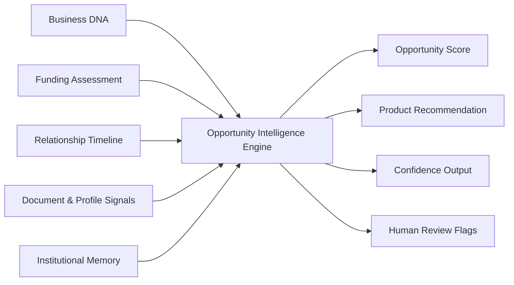
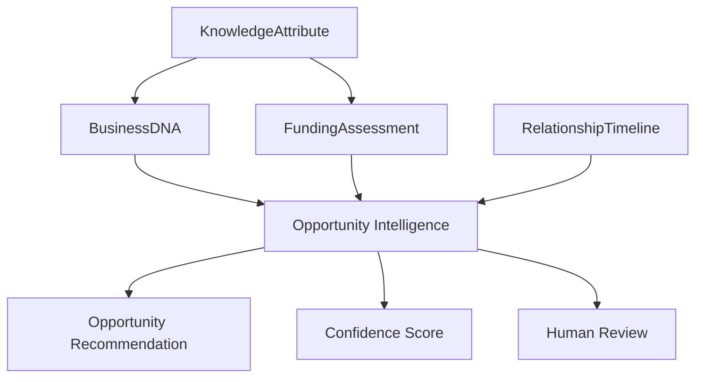

# Opportunity Intelligence Blueprint

**Version:** 1.0 (Concept)
**Status:** Foundational Architecture
**Owner:** Deepsea Nexus
**Classification:** Internal Intellectual Property

---

## 1. Vision

The Opportunity Intelligence Engine is the layer of DNOS that helps Deepsea recognize which businesses are worth pursuing, why they matter, what facility is most appropriate, and how confident the institution should be in the opportunity.

It does not replace relationship managers or decision-makers. It gives them a clearer, faster, and more institutional way to understand commercial opportunities before time is spent on manual review.

The vision is to turn fragmented signals into a structured opportunity view that is explainable, prioritised, and ready for human judgment.

---

## 2. Purpose

The Opportunity Intelligence Engine exists to answer a simple institutional question:

> **Is this opportunity worth pursuing, and if so, what should Deepsea recommend next?**

Its purpose is to:

- identify high-value opportunities early
- rank opportunities by strength and readiness
- recommend the most suitable product or facility
- estimate a facility range or funding direction
- quantify confidence in the recommendation
- flag cases that require human review
- preserve explainability for business, risk, and leadership teams

This engine sits inside the DNOS intelligence layer and supports the broader relationship-led operating model.

---

## 3. Inputs

The Opportunity Intelligence Engine should consume institutional inputs already produced by DNOS workflows and engines.

Typical inputs include:

- business identity and legal profile
- industry and business model signals
- financial need and funding intent
- document completeness and recency
- relationship stage and engagement signals
- timeline events and interaction history
- funding assessment outputs
- business intelligence score or similar profile confidence
- jurisdiction and operating geography
- relationship manager notes and prioritisation cues
- institutional memory and precedent patterns

The engine should work with partial information and still produce a useful recommendation, while lowering confidence when inputs are sparse or inconsistent.

### Input Flow

---

## 4. Institutional Models Used

The engine should rely on institutional models rather than raw freeform summaries.

Primary models include:

- **BusinessDNA** — identity, business, financial, behavioural, relationship, and intelligence attributes
- **FundingAssessment** — facility recommendation, advance rate, risk level, turnaround, and recommendation narrative
- **RelationshipTimeline** — lifecycle events showing where the business is in the institutional journey
- **KnowledgeAttribute** — typed, confidence-bearing attributes used across the DNOS model layer
- **Institutional memory patterns** — precedent and historical pattern recognition when available

The engine should read from these models and emit a structured opportunity view that can be consumed by workspaces, orchestration layers, and leadership dashboards.

### Model Relationship

---

## 5. Opportunity Scoring

Opportunity scoring should evaluate whether the business deserves active pursuit and how strong the commercial case is.

Scoring should consider:

- completeness of business profile
- quality and freshness of supporting data
- clarity of funding need
- strength of relationship engagement
- alignment between business type and facility type
- operating scale and commercial potential
- jurisdiction and execution context
- historical precedent and institutional memory

A practical score should reflect both value and readiness.

Recommended dimensions:

- **Commercial Attractiveness** — size, growth, and strategic value
- **Readiness** — how complete and actionable the current information is
- **Relationship Strength** — warmth, responsiveness, and stage
- **Product Fit** — how closely the business matches a Deepsea facility
- **Execution Confidence** — whether the opportunity can be progressed with discipline

The final score should be explainable and decomposable into component signals rather than a black box.

Suggested output shape:

- Opportunity Score: 0-100
- Priority Band: High / Medium / Low
- Pursuit Recommendation: Pursue / Monitor / Defer

---

## 6. Product Recommendation

The engine should recommend the most suitable product or facility based on the business profile and current need.

Examples of recommendation logic:

- invoice-heavy businesses may align with Invoice Financing
- businesses with recurring working capital pressure may align with a Working Capital Line
- growing companies with expansion intent may align with a Business Expansion Facility
- mixed or uncertain cases may require a review recommendation rather than a direct facility suggestion

The product recommendation should answer:

- what product best fits the opportunity
- why that product fits
- what evidence supports the recommendation
- whether the recommendation is immediate or provisional

The recommendation must not be treated as final approval. It is an opportunity-level suggestion that supports human review.

---

## 7. Facility Estimation

The engine should estimate a facility range or directional facility value to help teams understand the commercial opportunity.

Facility estimation may include:

- indicative product type
- estimated ticket size
- likely advance rate range
- estimated confidence in fit
- potential turnaround expectation

Facility estimation should be derived from structured institutional inputs rather than an isolated guess.

Examples:

- a business with strong receivables and moderate risk may point to a higher invoice financing range
- a high-growth business with larger working capital needs may point to an expansion-oriented facility
- incomplete information should suppress aggressive facility assumptions

The engine should express estimation as a range or directional value when precision is not justified.

---

## 8. Confidence Calculation

Confidence should measure how reliable the opportunity recommendation is, not just whether the engine produced a result.

Confidence should rise when:

- profile completeness is high
- business identity is clear
- funding need is explicit
- timeline and relationship signals are current
- the product match is strong
- institutional memory supports the pattern

Confidence should fall when:

- documents are missing or stale
- funding intent is unclear
- relationship stage is ambiguous
- the business profile is sparse
- jurisdiction introduces uncertainty
- signals conflict with one another

A simple confidence model should remain explainable.

Suggested elements:

- input completeness
- signal consistency
- facility fit strength
- relationship clarity
- data recency
- historical precedent alignment

Confidence should always be visible to the user and should always accompany the opportunity recommendation.

---

## 9. Human Review

Human review is mandatory whenever the engine encounters ambiguity, conflict, or material uncertainty.

The engine should escalate to human review when:

- opportunity score is borderline
- facility fit is weak or contradictory
- confidence falls below an institutional threshold
- there are conflicting signals between relationship, financial, and timeline inputs
- the case involves unusual jurisdictional or commercial complexity
- the opportunity is strategically important but not yet well formed

The review output should say clearly:

- what the engine thinks
- what it is uncertain about
- what the human should examine next
- whether the opportunity should be pursued, monitored, or deferred

The engine must remain advisory, not autonomous, for final commercial decisions.

---

## 10. AI Boundaries

The Opportunity Intelligence Engine must remain within clear institutional boundaries.

It should not:

- approve funding on its own
- fabricate missing business facts
- override policy, risk, or legal controls
- infer sensitive facts without source support
- make irreversible decisions without human oversight
- hide uncertainty behind a single score

It should:

- explain its reasoning
- preserve source attribution where possible
- surface uncertainty explicitly
- operate within DNOS policy and architecture
- defer to humans when the case is unclear or high impact

The correct role of the engine is recommendation, prioritisation, and explanation.

---

## 11. Future Learning

The engine should improve over time through institutional learning.

Future learning sources may include:

- accepted and rejected opportunities
- RM and executive feedback
- downstream performance of recommended facilities
- pattern success by industry, jurisdiction, and product type
- confidence calibration against real outcomes
- relationship progression history

Learning should improve:

- opportunity ranking
- product matching
- confidence calibration
- review thresholds
- pattern recognition
- institutional precedent recall

The learning loop must remain governed and explainable. Deepsea should learn from outcomes without turning the model into an opaque black box.

---

## 12. Roadmap

A practical roadmap for the Opportunity Intelligence Engine should evolve in stages.

### Phase 1 - Rule-Guided Opportunity Scoring

- deterministic opportunity ranking
- structured product recommendation
- confidence based on data completeness and signal consistency
- manual review triggers

### Phase 2 - Relationship-Aware Intelligence

- stronger use of relationship timeline signals
- prioritisation by engagement stage
- better connection between opportunity score and RM workflow
- executive visibility into the active opportunity set

### Phase 3 - Portfolio Learning

- calibration from accepted and rejected opportunities
- outcome-based ranking improvements
- industry and jurisdiction pattern recognition
- improved facility estimation confidence

### Phase 4 - Institutional Recommendation Layer

- opportunity suggestions across multiple products
- context-aware next-best-action outputs
- deeper integration with executive and RM workspaces
- stronger alignment with institutional memory

### Phase 5 - Adaptive DNOS Intelligence

- continuous learning across the relationship lifecycle
- opportunity intelligence that adapts to institutional behaviour
- richer explainability for leadership and governance teams
- broader use across future Deepsea products and markets

---

## Operating Summary

The Opportunity Intelligence Engine should help Deepsea do three things well:

1. See the right opportunity early.
2. Recommend the right product with discipline.
3. Escalate uncertainty to humans before the institution overcommits.

That is the role of opportunity intelligence inside DNOS: not to replace judgment, but to make judgment faster, clearer, and more institutional.
