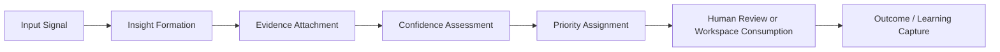
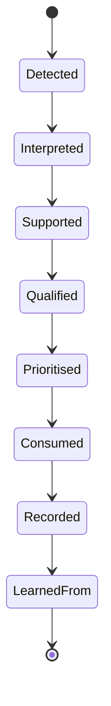
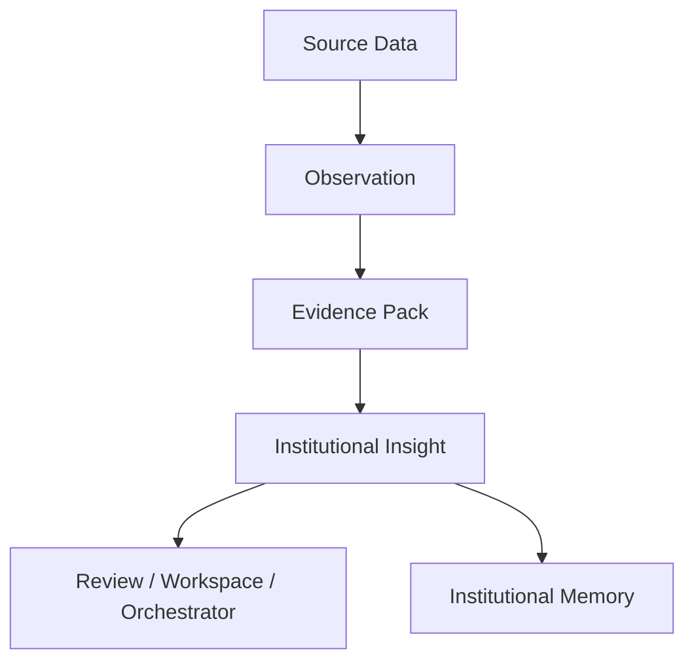
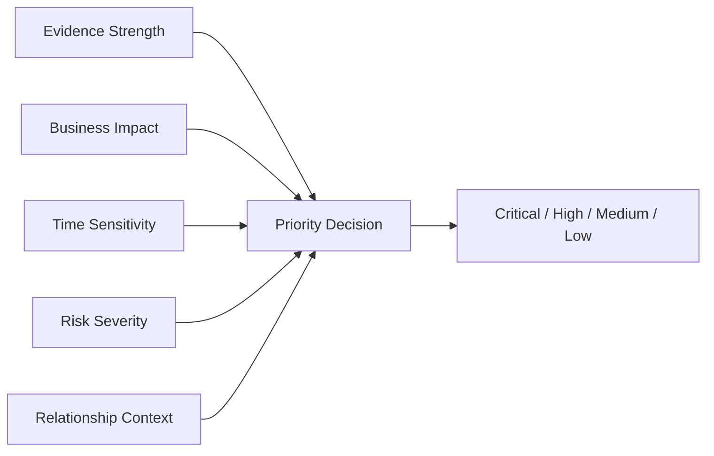
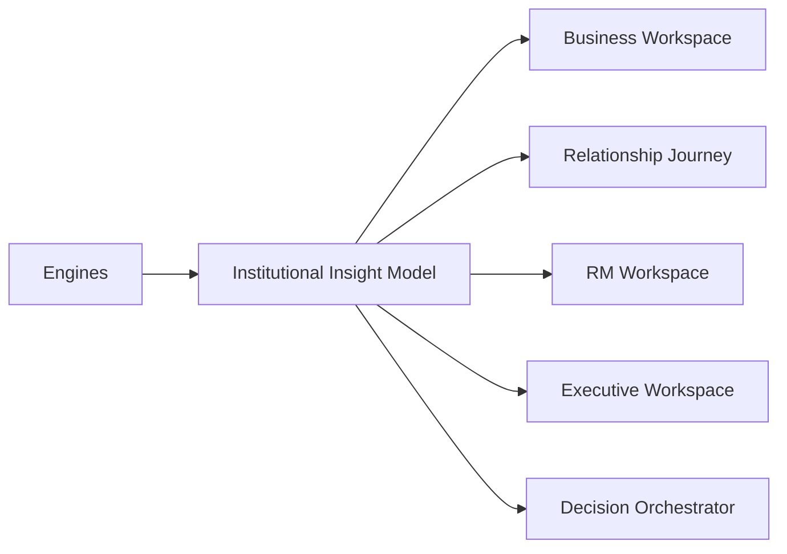
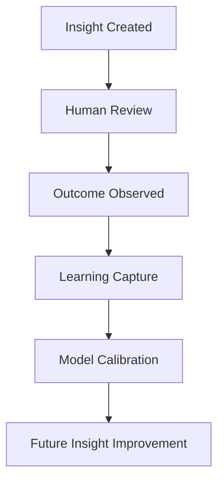

# Institutional Insights

**Version:** 1.0 (Concept)
**Status:** Foundational Architecture
**Owner:** Deepsea Nexus
**Classification:** Internal Intellectual Property

---

## 1. Vision

Institutional Insight is the common reasoning layer used by every DNOS intelligence engine to explain what the system knows, why it believes it, and how strongly it should act on it.

The vision is to create a shared, governed interpretation layer that turns raw inputs into institutional understanding. Instead of each engine producing isolated outputs, every engine should express its findings as structured insights that can be reviewed, compared, reused, and learned from across the platform.

Institutional Insight is not a score by itself. It is the atomic unit of explainable intelligence inside DNOS.

---

## 2. Purpose

The purpose of the Institutional Insight model is to standardize how intelligence is captured, evaluated, prioritized, consumed, and learned across DNOS.

It exists to:

- give every engine a common output structure
- preserve explainability across workflows
- support human review and governance
- enable consistent prioritization across products and workspaces
- record evidence, confidence, and decision relevance in a reusable format
- feed Institutional Memory and Learning Framework processes with durable knowledge

The model aligns with DNOS Architecture v1.0 by treating intelligence as layered, governable, auditable, and human-supervised.

---

## 3. Institutional Insight Definition

An Institutional Insight is a structured, confidence-bearing interpretation of a business fact, signal, pattern, risk, opportunity, or decision cue.

It should answer four questions:

1. What was observed?
2. Why does it matter?
3. How confident is the system?
4. What should happen next?

An insight is stronger than a raw data point and lighter than a final decision. It is the bridge between evidence and action.

### Insight Characteristics

An Institutional Insight should always have:

- a clear subject
- a defined category
- evidence supporting the interpretation
- a confidence measure
- a priority level
- a human-review posture when needed
- a lifecycle state
- a consumer-facing explanation

### Insight Structure

---

## 4. Categories

Institutional Insights should be grouped into categories that reflect how DNOS reasons across business, risk, relationship, and portfolio contexts.

Recommended categories include:

- **Identity Insight** — who the business or counterparty is
- **Commercial Insight** — what the business does and how it operates
- **Financial Insight** — how the business performs, earns, and funds itself
- **Relationship Insight** — how the business engages with Deepsea
- **Opportunity Insight** — whether the case is worth pursuing
- **Risk Insight** — what could go wrong and why
- **Product Insight** — which facility or product is most appropriate
- **Timeline Insight** — what has happened and what should happen next
- **Governance Insight** — what requires review, approval, or exception handling
- **Portfolio Insight** — how the case affects broader institutional priorities

Categories should remain extensible so future DNOS engines can add domain-specific insight classes without breaking the common model.

---

## 5. Lifecycle

Every Institutional Insight should move through a predictable lifecycle.

### Lifecycle Stages

1. **Detected** — a signal, event, or pattern is identified
2. **Interpreted** — the system converts the signal into institutional meaning
3. **Supported** — evidence is attached from source inputs or models
4. **Qualified** — confidence, relevance, and category are assigned
5. **Prioritised** — the insight is ranked for action or review
6. **Consumed** — a workspace, orchestrator, or engine uses the insight
7. **Recorded** — the insight is preserved in audit and memory systems
8. **Learned From** — outcome feedback updates future insight quality

### Lifecycle Diagram

The lifecycle should be deterministic enough to audit, but flexible enough to support different engines and use cases.

---

## 6. Confidence Model

Confidence expresses how reliable an insight is and how much weight it should receive.

Confidence should reflect:

- data completeness
- source reliability
- recency of the signal
- consistency across inputs
- fit with historical precedent
- ambiguity or conflict in the evidence

A high-confidence insight is not necessarily a final decision. It is a well-supported interpretation with strong evidence and low uncertainty.

### Confidence Bands

- **90-100**: highly reliable, strong evidence, low ambiguity
- **75-89**: reliable, some nuance or incomplete detail
- **50-74**: useful but requires caution or further validation
- **0-49**: weak, incomplete, or highly uncertain

### Confidence Principles

- confidence must be visible
- confidence must be explainable
- confidence must not be hidden behind a score alone
- low confidence should trigger review, not forced certainty
- confidence should improve or decline as evidence changes

Confidence should be calculated consistently across engines, even if the exact weighting differs by domain.

---

## 7. Evidence Model

Every Institutional Insight should be evidence-backed.

Evidence is the set of source observations, facts, documents, timeline entries, and model attributes that justify the insight.

Evidence should capture:

- source type
- source identifier or reference
- observation summary
- relevance to the insight
- confidence in the evidence itself
- timestamp or recency
- provenance where available

The evidence model should support traceability from insight back to source.

### Evidence Rules

- no insight should appear without evidence unless explicitly marked as speculative
- evidence should be attributable whenever possible
- conflicting evidence should be preserved, not hidden
- evidence should be available to humans during review
- evidence should remain usable by memory and learning systems

### Evidence Flow

---

## 8. Priority Model

Priority determines whether an insight should be acted on now, monitored, or deferred.

Priority should be based on:

- business impact
- risk severity
- time sensitivity
- relationship stage
- opportunity value
- regulatory or governance importance
- confidence level

### Priority Bands

- **Critical** — immediate human attention required
- **High** — should be addressed in the current workflow
- **Medium** — important, but not urgent
- **Low** — useful context, monitor over time

Priority is not the same as confidence. A low-confidence insight may still be critical if it exposes a material risk. A high-confidence insight may be low priority if it is informative but not urgent.

### Priority Logic

---

## 9. Human Review Workflow

Human review is required whenever the system cannot confidently classify, prioritise, or interpret an insight on its own.

The review workflow should be:

1. detect uncertain or conflicting insight
2. surface the insight with evidence and rationale
3. highlight the missing information or ambiguity
4. request human judgment or policy decision
5. capture the human response and rationale
6. record the final outcome for future learning

### Review Triggers

Human review should be triggered when:

- confidence is below threshold
- evidence conflicts
- the insight is strategically important
- a policy exception may be involved
- the insight affects approval, risk, or client treatment
- the engine has insufficient historical precedent

The review workflow should preserve institutional discipline without blocking progress unnecessarily.

---

## 10. Workspace Consumption

Institutional Insights should be consumable by every DNOS workspace.

Examples include:

- **Business Workspace** — profile, readiness, and relationship context
- **Relationship Journey** — next steps, status, and engagement state
- **RM Workspace** — prioritisation, task queues, and relationship guidance
- **Executive Workspace** — portfolio-level prioritisation and oversight
- **Decision Orchestrator** — coordinated recommendations and exceptions

Workspaces should not need to understand raw engine internals. They should consume structured insights that are already interpreted, prioritised, and explainable.

### Consumption Pattern

---

## 11. Audit & Governance

Institutional Insights must be auditable and governable across their full lifecycle.

The model should support:

- source traceability
- version history
- confidence history
- review history
- approval or override history
- outcome history
- policy alignment checks

Governance should answer:

- who created the insight
- what evidence supported it
- how confidence was determined
- whether a human reviewed it
- whether it was used in a decision
- what outcome followed

The audit layer should ensure the institution can reconstruct why a recommendation was made at any point in time.

### Governance Principle

The system should never behave as if an insight is self-justifying. Every meaningful insight must remain explainable, reviewable, and subject to policy.

---

## 12. Future Learning

Institutional Insight should become better through verified outcomes and human correction.

Future learning should improve:

- category assignment
- confidence calibration
- priority ranking
- evidence weighting
- review thresholds
- workspace relevance
- outcome prediction quality

Learning should be based on:

- human feedback
- verified outcomes
- workflow completion data
- decision overrides
- portfolio performance
- relationship progression

The learning loop should be governed so that updates remain transparent and reversible when needed.

### Learning Loop

---

## Operating Summary

Institutional Insight is the shared interpretive unit for DNOS.

It connects evidence to action, confidence to review, and workflow to governance. Every intelligence engine should express its findings through this model so Deepsea can reason consistently across the institution, preserve auditability, and improve through experience.
