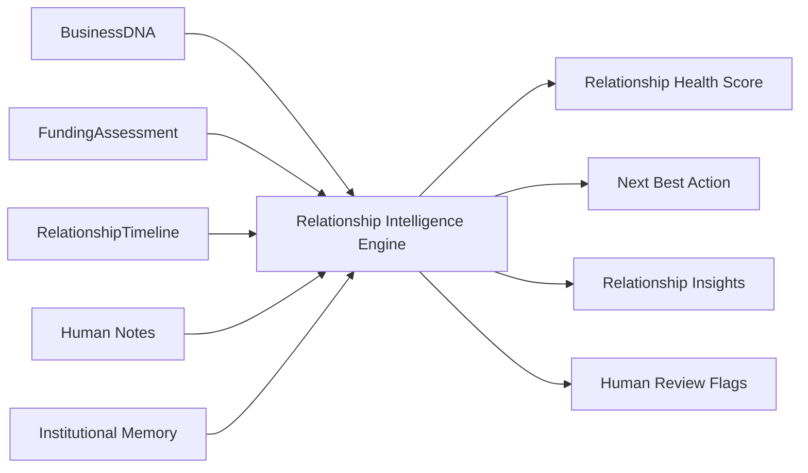
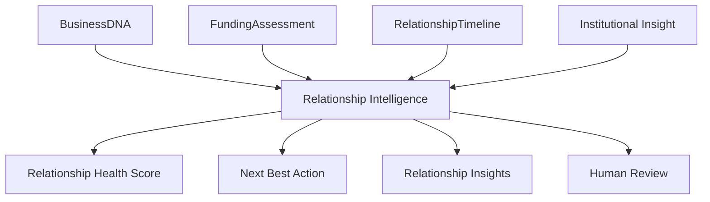
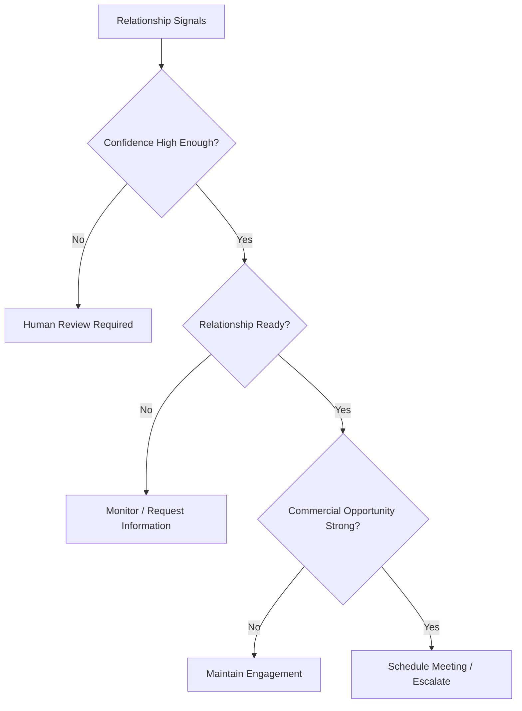

# Relationship Intelligence Blueprint

**Version:** 1.0 (Concept)
**Status:** Foundational Architecture
**Owner:** Deepsea Nexus
**Classification:** Internal Intellectual Property

---

## 1. Vision

Relationship Intelligence is the DNOS capability that helps Deepsea understand the state, strength, and direction of every business relationship.

The vision is to move beyond static CRM tracking and toward institutional relationship understanding. The engine should know not only who the customer is, but how the relationship is evolving, what matters next, and where human attention will have the greatest impact.

Relationship Intelligence is designed to make every interaction more informed, more timely, and more accountable.

---

## 2. Purpose

The purpose of the Relationship Intelligence Engine is to convert relationship signals into actionable institutional context.

It exists to:

- assess the current health of a relationship
- recommend the next best action
- surface meaningful relationship insights
- prioritize human follow-up
- preserve institutional continuity across users and time
- align relationship activity with funding and portfolio goals
- feed workspaces, orchestrators, and memory systems with structured insight

The engine aligns with DNOS Architecture v1.0 by treating relationships as governed institutional assets, not loose sales activities.

---

## 3. Inputs

The Relationship Intelligence Engine should consume structured relationship and business signals already available within DNOS.

Typical inputs include:

- BusinessDNA relationship attributes
- BusinessDNA financial and intelligence attributes
- funding assessment outputs
- relationship timeline events
- engagement history
- response behavior
- task and action history
- workspace usage patterns
- institutional memory and precedent
- human notes or manager observations where available
- jurisdiction and operating context

The engine should work with partial inputs, but must lower confidence when signals are sparse, stale, or contradictory.

### Input Flow

---

## 4. Institutional Models Used

The engine should depend on DNOS institutional models rather than unstructured narrative alone.

Primary models include:

- **BusinessDNA** — especially relationship, intelligence, and financial attributes
- **FundingAssessment** — facility context, confidence, and recommendation direction
- **RelationshipTimeline** — events, timing, progression, and stage changes
- **Institutional Insight** — common structured interpretation unit used across DNOS
- **KnowledgeAttribute** — source-bearing and confidence-bearing typed attribute
- **Institutional Memory** — precedent and relationship history across the lifecycle

The engine should not produce outputs that conflict with the broader DNOS insight model. Instead, it should express relationship reasoning through Institutional Insights that can be consumed by workspaces and orchestration layers.

### Model Relationship

---

## 5. Relationship Health Score

The Relationship Health Score measures how strong, active, and progression-ready the relationship is.

It should not be treated as a vanity metric. It is a structured assessment of whether Deepsea should invest more attention, whether the relationship is progressing, and whether the customer is responsive enough to justify escalation.

### Health Dimensions

The score should be informed by:

- responsiveness
- relationship stage
- recency of contact
- completeness of business understanding
- funding readiness
- trust level
- engagement momentum
- next step clarity
- timeline progression
- institutional precedent

### Suggested Bands

- **90-100**: strong, active, highly progression-ready
- **75-89**: healthy, responsive, and ready for directed action
- **50-74**: moderate health, requires attention or renewed engagement
- **0-49**: weak, dormant, or unclear relationship state

### Score Principles

- the score must be explainable
- the score should reflect both activity and quality
- stale or missing context should reduce the score
- a high score should indicate relationship readiness, not automatic approval
- the score should be complemented by supporting insights and evidence

---

## 6. Next Best Action Framework

The Next Best Action framework recommends the most appropriate follow-up step based on relationship state and business context.

It should answer:

- what should happen next
- who should act
- why that action is appropriate
- how urgent it is
- whether human review is required before action

### Common Action Types

- schedule a meeting
- send an email
- request missing information
- escalate to RM review
- move to executive follow-up
- monitor for response
- prepare for funding discussion
- update relationship stage

### Decision Logic

The engine should always prefer the smallest useful action that advances the relationship with discipline.

---

## 7. Relationship Insights

Relationship Insights are the structured observations the engine produces about the current state of the relationship.

Examples include:

- the founder is warm but has not yet been contacted by a manager
- the customer is responsive and ready for a meeting
- the funding goal is clear but requires confirmation
- the business is moving from understanding to review
- the next step should be an executive outreach sequence
- the relationship is healthy but waiting on one missing input

Insights should be written so that a relationship manager can act on them without having to decode internal model logic.

### Insight Characteristics

Each relationship insight should include:

- category
- explanation
- evidence
- confidence
- priority
- recommended action

Insights should be consumable by the Relationship Journey, RM Workspace, Executive Workspace, and Decision Orchestrator.

---

## 8. Confidence Model

Confidence measures how reliable the relationship interpretation is.

Confidence should reflect:

- completeness of relationship data
- freshness of contact and timeline information
- consistency between business, funding, and timeline signals
- quality of evidence supporting the interpretation
- historical precedent for similar relationship patterns
- absence or presence of conflicting signals

### Confidence Bands

- **90-100**: highly reliable relationship interpretation
- **75-89**: reliable with minor gaps
- **50-74**: directionally useful but should be treated carefully
- **0-49**: uncertain, incomplete, or weakly supported

### Confidence Rules

- confidence must be visible to humans
- low confidence should trigger review or monitoring
- confidence should never be confused with commercial value alone
- confidence should fall when the relationship is stale or contradictory
- confidence should rise when the relationship is active, clear, and progressing

---

## 9. Human Review

Human review is required whenever relationship interpretation is not sufficiently clear or when the next best action has material consequences.

Review should be triggered when:

- the relationship stage is unclear
- the response pattern is inconsistent
- the funding intent is not confirmed
- the next best action is ambiguous
- confidence falls below threshold
- the case is strategically important
- policy or relationship judgment is needed

### Review Workflow

1. detect uncertain relationship signal
2. surface the evidence and recommended action
3. explain what is missing or ambiguous
4. ask the human to confirm or override
5. capture the human decision and rationale
6. record the outcome for future learning

The engine should support relationship managers, executives, and governance users without replacing their judgment.

---

## 10. AI Boundaries

The Relationship Intelligence Engine must operate within strict institutional boundaries.

It should not:

- invent relationship facts
- claim certainty where evidence is weak
- override business, compliance, or risk policy
- auto-commit to commercial promises
- make final approval decisions
- conceal uncertainty behind a score

It should:

- interpret structured relationship signals
- explain why it thinks a relationship is healthy or weak
- show the evidence behind its recommendations
- support human follow-up and governance
- remain subject to policy and oversight

The correct role of the engine is relationship understanding, prioritisation, and explanation.

---

## 11. Future Learning

The engine should improve through verified outcomes and human feedback.

Future learning should refine:

- health scoring thresholds
- next best action selection
- relationship stage inference
- confidence calibration
- priority assignment
- insight quality

Learning sources may include:

- successful follow-ups
- missed follow-ups
- conversion outcomes
- funding progression
- human overrides
- RM feedback
- executive feedback
- portfolio performance patterns

Learning must remain governed, explainable, and reversible when needed.

---

## 12. Roadmap

A practical roadmap for Relationship Intelligence should evolve in stages.

### Phase 1 - Deterministic Relationship Scoring

- score based on timeline, engagement, and business context
- clear next best action rules
- basic relationship insights
- human review thresholds

### Phase 2 - Workspace-Aware Relationship Guidance

- stronger integration with RM Workspace
- relationship journey recommendations
- executive prioritisation support
- clearer action sequencing

### Phase 3 - Institutional Pattern Learning

- calibration from historical relationship outcomes
- action success analysis
- relationship stage prediction
- better confidence shaping

### Phase 4 - Cross-Engine Relationship Intelligence

- deeper integration with opportunity, funding, and insight engines
- shared institutional insight model across DNOS
- improved prioritisation across portfolio and account teams

### Phase 5 - Adaptive Relationship Operating Model

- continuously improving relationship guidance
- stronger learning from outcomes and overrides
- broader use across new products and regions
- fully governed institutional relationship intelligence

---

## Operating Summary

Relationship Intelligence is the layer that helps DNOS understand the health and momentum of every customer relationship.

It makes relationship management more disciplined, more explainable, and more consistent across the institution. It also ensures that the right next step is visible to the right person at the right time.

In DNOS, relationships are not just tracked. They are interpreted, prioritised, and learned from.
