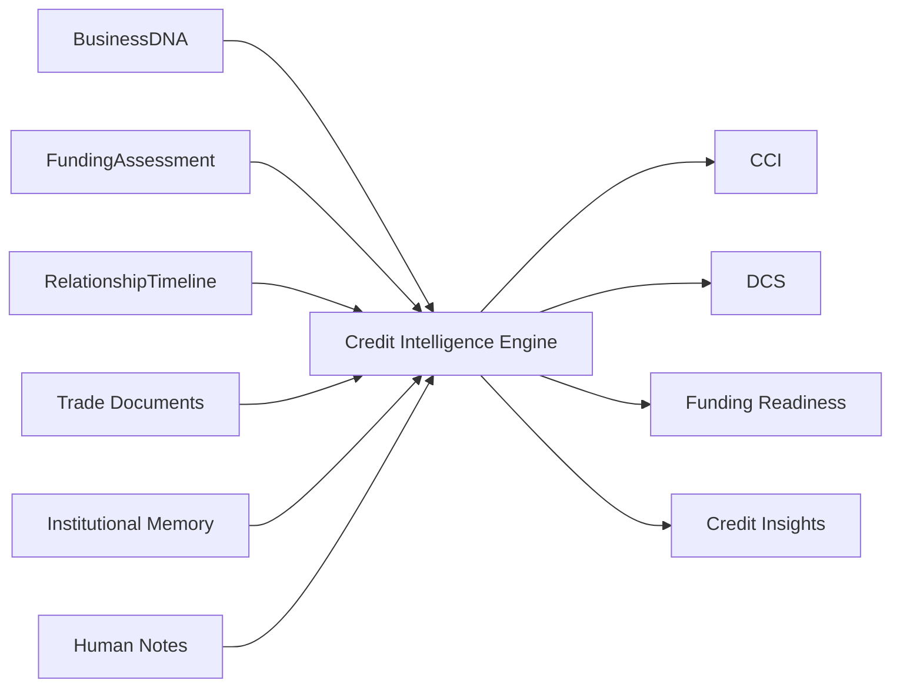
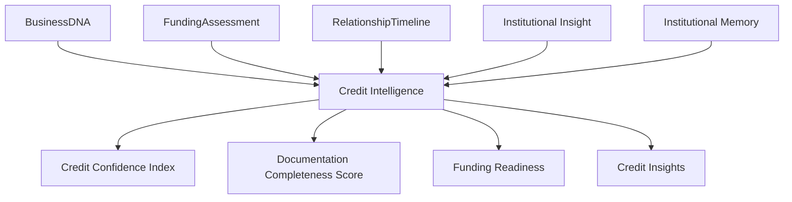

# Credit Intelligence Blueprint

**Version:** 1.0 (Concept)
**Status:** Foundational Architecture
**Owner:** Deepsea Nexus
**Classification:** Internal Intellectual Property

---

## 1. Vision

The Credit Intelligence Engine is the DNOS capability that evaluates whether a receivables finance, forfaiting, or structured trade finance opportunity is creditworthy, document-ready, and fit for institutional execution.

The vision is to replace narrow credit scoring with a governed credit-intelligence layer that understands the transaction, the counterparty, the documents, the trade cycle, and the recoverability profile of the asset.

Credit intelligence in DNOS should feel institutional from the first review. It should make Deepsea faster, more disciplined, and more confident without losing explainability or human control.

---

## 2. Purpose

The purpose of the Credit Intelligence Engine is to convert business, financial, documentary, and trade signals into a structured credit view that can support funding decisions.

It exists to:

- evaluate creditworthiness in trade and receivables contexts
- assess documentation completeness and enforceability readiness
- estimate credit confidence and funding readiness
- support receivables finance, forfaiting, and structured trade finance workflows
- surface credit risks, gaps, and exceptions early
- generate explainable insights for workspaces and orchestration layers
- feed Institutional Memory and Learning Framework processes with verified outcomes

The engine aligns with DNOS Architecture v1.0 by treating credit as an institutional reasoning layer, not a standalone score.

---

## 3. Inputs

The Credit Intelligence Engine should consume structured inputs that reflect the transaction and the business behind it.

Typical inputs include:

- BusinessDNA identity, business, financial, behaviour, relationship, and intelligence attributes
- funding assessment outputs
- relationship timeline events
- invoice, receivable, and trade document signals
- counterparty and obligor information
- payment behaviour and collection history
- jurisdiction and trade route context
- facility type and commercial purpose
- institutional memory and precedent patterns
- human notes or RM observations where available

The engine should be able to work with partial information, but confidence and readiness should decline when the trade file is incomplete or inconsistent.

### Input Flow

---

## 4. Institutional Models Used

The Credit Intelligence Engine should rely on institutional models already established in DNOS.

Primary models include:

- **BusinessDNA** — identity, business, financial, behavioural, relationship, and intelligence attributes
- **FundingAssessment** — funding direction, confidence, recommendation, and facility context
- **RelationshipTimeline** — progression, events, and relationship context
- **Institutional Insight** — common structured unit for explainable intelligence across DNOS
- **KnowledgeAttribute** — typed attribute with value, confidence, source, and update metadata
- **Institutional Memory** — historical payment behaviour, recoveries, defaults, and prior trade precedent

The engine should express findings as Institutional Insights so that workspaces, orchestrators, and governance layers can consume them consistently.

### Model Relationship

---

## 5. Credit Confidence Index (CCI)

The Credit Confidence Index measures how confident DNOS should be in the overall credit view of the opportunity.

CCI is not a simple borrower score. It is an institutional confidence measure that reflects how well the transaction is understood, how coherent the evidence is, and how strong the trade-credit fit appears.

### CCI Should Reflect

- completeness of the trade file
- reliability of business and counterparty information
- consistency of receivables or trade documentation
- payment behaviour and settlement history
- product fit for receivables finance, forfaiting, or structured trade finance
- jurisdictional clarity and enforceability context
- internal precedent and historical outcomes
- evidence consistency across models

### Suggested Bands

- **90-100**: very strong credit understanding, low ambiguity
- **75-89**: strong credit understanding with limited gaps
- **50-74**: useful but requires caution or additional validation
- **0-49**: weak credit understanding or material uncertainty

### CCI Principles

- CCI must be explainable
- CCI must remain tied to evidence and institutional context
- CCI should rise with document quality and consistent trade signals
- CCI should fall when trade or counterparty information is incomplete or contradictory
- CCI should never be used as a replacement for human credit judgment

---

## 6. Documentation Completeness Score (DCS)

The Documentation Completeness Score measures how complete the credit file is for review and execution.

This score is essential in receivables finance and trade finance because the quality of the documentation often determines both the viability of the transaction and the strength of recovery.

### DCS Should Consider

- presence of required trade documents
- invoice validity and consistency
- shipment or delivery evidence where relevant
- obligor information completeness
- assignment or transfer documentation
- KYC and legal entity completeness
- payment terms clarity
- jurisdiction-specific support documents
- missing or stale documents

### DCS Bands

- **90-100**: complete file, ready for substantive review
- **75-89**: mostly complete, minor items outstanding
- **50-74**: partial file, review possible but constrained
- **0-49**: materially incomplete, not ready for execution

### DCS Principles

- DCS should be visible and actionable
- DCS should identify specific missing items
- DCS should be separate from risk quality
- a complete but weak file is different from an incomplete but strong file
- incomplete documentation should trigger review or hold status, not hidden approval

---

## 7. Funding Readiness

Funding readiness measures whether the opportunity is sufficiently understood, documented, and aligned to move forward in the credit workflow.

In Deepsea’s trade finance philosophy, readiness is not only about whether a business wants capital. It is about whether the receivable, trade flow, obligor support, and documentation are strong enough for institutional execution.

Funding readiness should reflect:

- CCI strength
- DCS strength
- product fit
- trade structure clarity
- counterparty support
- jurisdiction and enforceability clarity
- operational readiness for execution
- human review status

### Funding Readiness Bands

- **Ready** — can progress to the next institutional step
- **Nearly Ready** — minor gaps remain and should be resolved
- **Needs Review** — requires human validation before moving forward
- **Not Ready** — material gaps or uncertainty prevent progression

Funding readiness should be reflected in the workspace layer and in downstream orchestration decisions.

---

## 8. Credit Insights

Credit Insights are the structured observations produced by the engine about the opportunity, the trade file, and the counterparty.

Examples include:

- receivables are supported by a consistent payment pattern
- the trade file is complete enough for first-pass review
- the obligor profile is stronger than the seller profile
- the jurisdiction supports a stronger enforcement posture
- forfaiting is better suited than revolving receivables finance
- the documentation gap is the primary blocker, not the business itself
- the asset is creditworthy but not yet operationally ready

Credit Insights should be written so that a credit officer or RM can understand them immediately.

### Insight Characteristics

Each credit insight should include:

- category
- explanation
- evidence
- confidence
- priority
- recommended next action

Credit insights should be consumable by the Credit Workspace, Decision Orchestrator, RM Workspace, and Executive Workspace where relevant.

---

## 9. Explainability Framework

The Credit Intelligence Engine must always explain why it reached its conclusion.

Every recommendation should support the following layers of explanation:

### Observations

What was seen in the business, trade flow, documentation, or payment pattern?

### Interpretation

What does the system believe those observations mean in a credit context?

### Evidence

Which documents, timeline events, attributes, or precedent patterns support the interpretation?

### Confidence

How strong is the conclusion, and what lowers certainty?

### Alternatives

What other credit interpretations were considered, and why were they rejected or downgraded?

### Human Decision Points

What must a credit officer or committee decide directly?

This framework aligns with the Institutional Insight model and ensures that credit output remains usable in audit, review, and committee settings.

---

## 10. Human Review Workflow

Human review is required whenever the engine cannot establish a sufficiently clear, explainable, and policy-aligned credit view.

### Review Triggers

Human review should be triggered when:

- the CCI falls below threshold
- the DCS is materially incomplete
- the facility fit is ambiguous
- receivable support or trade evidence is weak
- the obligor or jurisdiction introduces uncertainty
- credit signals conflict across source models
- the case is strategically important or unusual

### Review Workflow

1. detect weak or conflicting credit signals
2. surface the CCI, DCS, readiness, and key insights
3. highlight missing or stale documents
4. explain the trade or receivables rationale
5. request human validation or exception handling
6. record the final credit outcome and rationale

Human review should not be treated as failure. In trade finance, human judgment is often the correct institutional control for nuanced or high-value cases.

---

## 11. AI Boundaries

The Credit Intelligence Engine must remain within clear DNOS boundaries.

It should not:

- approve funding autonomously
- fabricate trade, payment, or obligor facts
- override legal, regulatory, or policy controls
- hide uncertainty behind an opaque score
- treat incomplete documents as complete
- ignore jurisdictional or enforceability context

It should:

- interpret structured credit and trade signals
- explain why a receivables finance, forfaiting, or structured trade finance opportunity is attractive or weak
- expose documentation gaps clearly
- surface human review requirements early
- remain governed by institutional policy and oversight

The engine’s role is to inform credit judgment, not replace it.

---

## 12. Future Learning

The Credit Intelligence Engine should improve through verified outcomes and controlled institutional feedback.

Future learning should refine:

- CCI calibration
- DCS thresholds
- funding readiness logic
- product fit scoring
- documentation gap recognition
- jurisdictional pattern weighting
- recoverability assumptions

Learning sources may include:

- approved and rejected transactions
- collections performance
- recoveries and defaults
- human committee overrides
- documentation quality outcomes
- structured trade finance precedents
- receivables finance repayment history

Learning must remain transparent, versioned, and reversible.

---

## 13. Roadmap

A practical roadmap for the Credit Intelligence Engine should evolve in stages.

### Phase 1 - Deterministic Trade Credit Assessment

- CCI and DCS calculation
- funding readiness classification
- explainable credit insights
- human review triggers

### Phase 2 - Product-Specific Credit Guidance

- stronger differentiation between receivables finance, forfaiting, and structured trade finance
- clearer product recommendation logic
- improved documentation gap handling
- better jurisdiction-aware outputs

### Phase 3 - Institutional Pattern Learning

- calibration from outcomes and overrides
- stronger precedent matching
- confidence refinement
- portfolio learning from recoveries and defaults

### Phase 4 - Cross-Engine Credit Intelligence

- tighter integration with Opportunity, Relationship, and Funding Intelligence
- shared Institutional Insight model across DNOS
- stronger orchestration and workspace consumption

### Phase 5 - Adaptive Trade Credit Operating Model

- continuously improving credit guidance
- deeper use of verified outcomes and institutional memory
- broader support for new markets and products
- more nuanced but still explainable trade finance intelligence

---

## Operating Summary

The Credit Intelligence Engine helps Deepsea decide whether a trade or receivables opportunity is credible, documented, and ready for institutional action.

It is designed for the realities of receivables finance, forfaiting, and structured trade finance, where documentation quality, obligor support, and recovery logic matter as much as the underlying business.

In DNOS, credit is not just risk measurement. It is institutional understanding expressed with evidence, confidence, and disciplined human oversight.
