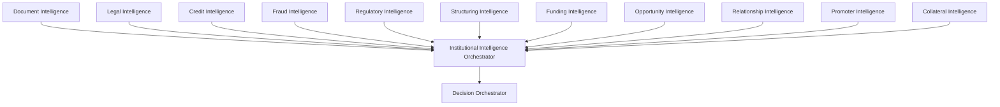
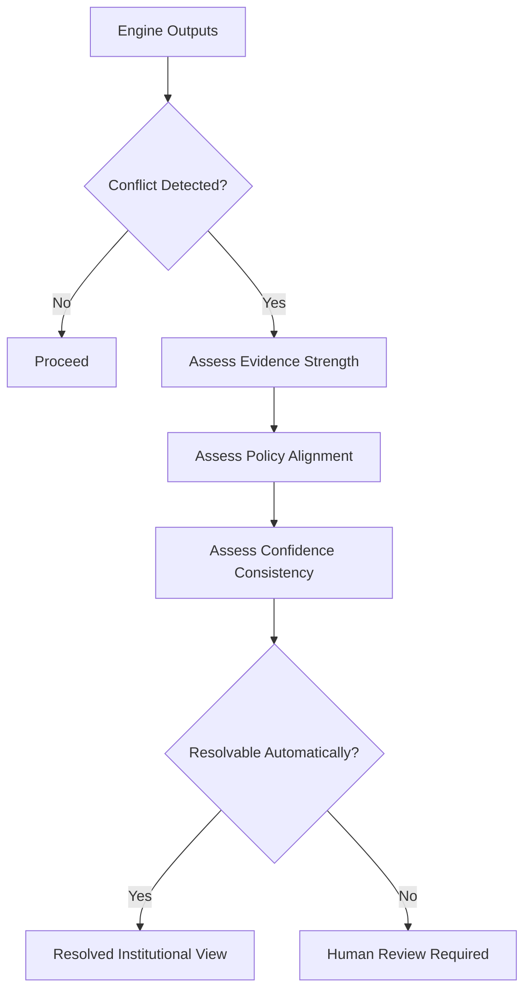
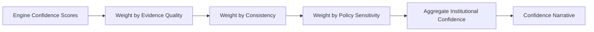
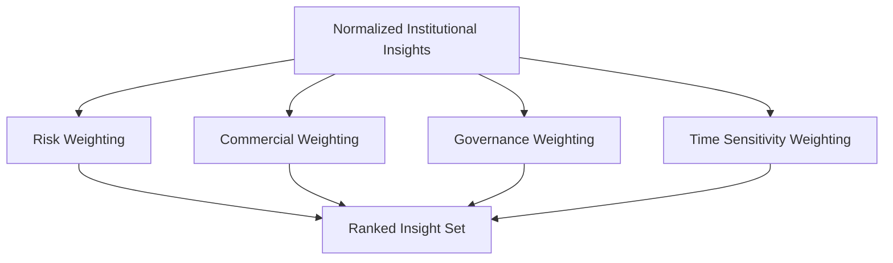

# Institutional Intelligence Orchestrator Blueprint

**Version:** 1.0 (Concept)
**Status:** Foundational Architecture
**Owner:** Deepsea Nexus
**Classification:** Internal Intellectual Property

---

## 1. Vision

The Institutional Intelligence Orchestrator is the DNOS coordination layer that turns multiple specialist intelligence outputs into one coherent institutional view.

Its vision is to ensure that Deepsea never treats intelligence as a collection of isolated engine outputs. Instead, every specialized engine contributes to a governed orchestration layer that resolves conflicts, aggregates confidence, prioritizes insights, and produces a clear narrative for humans.

The orchestrator is the institutional conductor. It does not replace specialist engines. It ensures they work together as one explainable system.

---

## 2. Purpose

The purpose of the Institutional Intelligence Orchestrator is to coordinate every intelligence engine within DNOS and turn their outputs into a usable institutional recommendation.

It exists to:

- collect and validate specialist engine outputs
- resolve conflicting interpretations
- aggregate confidence across engines
- prioritize the most important insights
- generate executive-facing narrative summaries
- route uncertain cases to human review
- preserve auditability and governance across the decision flow
- feed Institutional Memory and Future Learning processes

The orchestrator aligns with DNOS Architecture v1.0 by acting as the synthesis layer between specialist intelligence and human decision-making.

---

## 3. Participating Intelligence Engines

The orchestrator coordinates the specialist engines that already exist within the DNOS architecture.

Core participating engines include:

- **Document Intelligence Engine** — document extraction, classification, and completeness
- **Legal Intelligence Engine** — legal enforceability, compliance, and protections
- **Credit Intelligence Engine** — creditworthiness, documentation readiness, and funding readiness
- **Fraud Intelligence Engine** — identity, anomaly, and fraud risk analysis
- **Regulatory Intelligence Engine** — sanctions, compliance, and jurisdictional constraints
- **Structuring Intelligence Engine** — product design, protection, and transaction structure
- **Funding Intelligence Engine** — capital allocation, liquidity, and funding execution
- **Opportunity Intelligence Engine** — commercial attractiveness and opportunity prioritization
- **Relationship Intelligence Engine** — relationship health, engagement, and next best action
- **Promoter Intelligence Engine** — sponsor credibility, governance, and reliability
- **Collateral Intelligence Engine** — collateral support, enforceability, and recovery profile
- **Decision Orchestrator** — downstream synthesis for final recommendation

The orchestrator must remain extensible so future engines can be added without breaking the coordination model.

### Engine Network

---

## 4. Input Contracts

The orchestrator should receive structured input contracts rather than freeform text whenever possible.

Each engine should submit an intelligence package containing:

- engine name
- engine version
- subject or case identifier
- category or domain
- structured findings
- confidence score
- evidence references
- priority level
- human review flags
- recommended action or recommendation class
- timestamp and lineage metadata

The orchestrator should also consume cross-engine context such as:

- shared BusinessDNA and institutional models
- relationship timeline events
- funding assessment outputs
- Institutional Insights
- Institutional Memory references
- policy and governance constraints

### Contract Flow

The orchestrator should reject or downgrade malformed, incomplete, or unverifiable engine outputs.

---

## 5. Conflict Resolution

Conflict resolution is one of the orchestrator’s primary responsibilities.

It should detect when specialist engines disagree on:

- risk severity
- product suitability
- document sufficiency
- relationship readiness
- funding readiness
- regulatory permissibility
- required human review

### Conflict Resolution Principles

- preserve conflicting viewpoints rather than overwriting them
- surface the conflict explicitly
- prefer evidence quality over score magnitude alone
- prefer policy-aligned outputs over unsupported optimism
- escalate unresolved conflicts to human review
- retain both the dominant and minority interpretations in the audit trail

### Resolution Logic

The orchestrator should never resolve conflict by hiding the disagreement. It should resolve by explaining why one interpretation is preferred or why human judgment is required.

---

## 6. Confidence Aggregation

The orchestrator should aggregate confidence from all participating engines into a coordinated institutional confidence view.

Confidence aggregation should consider:

- individual engine confidence
- evidence quality
- source consistency
- recency of information
- policy sensitivity
- number of reinforcing engines
- number of conflicting engines

The orchestrator should distinguish between:

- **engine confidence** — how certain a specialist engine is
- **institutional confidence** — how reliable the coordinated view is

A strong institutional view should reflect agreement across engines, not just one highly confident engine.

### Aggregation Model

Confidence should rise when multiple engines reinforce the same conclusion and should fall when important engines disagree or critical evidence is weak.

---

## 7. Insight Prioritization

The orchestrator should prioritize insights so humans see the most important items first.

Prioritization should consider:

- risk severity
- commercial value
- time sensitivity
- governance impact
- confidence level
- relationship urgency
- funding materiality
- operational readiness

### Priority Bands

- **Critical** — immediate attention or escalation required
- **High** — should be reviewed in the current workflow
- **Medium** — important but not urgent
- **Low** — contextual or informational

The orchestrator should return a ranked insight set rather than an undifferentiated list.

### Prioritization Flow

Prioritization should always be explainable so the user can see why one insight outranks another.

---

## 8. Executive Narrative Generation

The orchestrator should generate a concise narrative that executives and decision-makers can understand quickly.

The narrative should answer:

- what the orchestrator sees
- what matters most
- what the main risks are
- what the recommended path is
- what needs human attention

The narrative should not be a generic summary. It should be a coherent institutional explanation that reflects the actual engine outputs.

### Narrative Qualities

The executive narrative should be:

- concise
- factual
- institutionally framed
- easy to review under time pressure
- aligned with the top priorities
- explicit about uncertainty

The narrative should be suitable for the Decision Orchestrator, RM Workspace, Executive Workspace, and governance review.

---

## 9. Human Review

Human review is mandatory whenever the orchestrator cannot safely reconcile the inputs or the outcome has material institutional impact.

### Review Triggers

Human review should be triggered when:

- specialist engines materially disagree
- confidence is below threshold
- policy or regulatory uncertainty exists
- the case is strategically important
- the opportunity is high value but weakly supported
- the narrative relies on too many assumptions
- a decision exception may be required

### Review Workflow

1. detect unresolved conflict or uncertainty
2. surface the ranked insights and disagreements
3. provide confidence and evidence summaries
4. highlight policy-sensitive issues
5. request human decision or override
6. record the final human outcome and rationale

The orchestrator should make human review efficient, not burdensome.

---

## 10. Audit & Governance

The orchestrator must maintain a complete audit trail for every synthesis step.

It should record:

- incoming engine outputs
- normalization steps
- conflict detection results
- confidence aggregation inputs
- prioritization logic
- narrative generation inputs
- human review decisions
- final routed outcome

The audit layer should support:

- traceability
- reproducibility
- version history
- policy validation
- compliance review
- learning analysis

### Governance Principle

No institutional conclusion should be treated as final unless the data lineage and orchestration path can be reconstructed.

The orchestrator is therefore not only a reasoning layer. It is also an accountability layer.

---

## 11. Future Learning

The orchestrator should improve through verified outcomes and human feedback.

Future learning should refine:

- conflict resolution thresholds
- confidence weighting rules
- prioritization logic
- narrative quality
- routing decisions
- engine consistency patterns

Learning sources may include:

- human overrides
- committee outcomes
- downstream funding and relationship outcomes
- conflict resolution success rates
- false positives and false negatives from orchestration
- workspace usage patterns

Learning should remain governed and reversible. Changes to orchestration logic should be versioned, explainable, and auditable.

---

## 12. Roadmap

A practical roadmap for the orchestrator should evolve in stages.

### Phase 1 - Deterministic Synthesis

- contract validation
- normalized insight aggregation
- rule-based conflict resolution
- ranked insight output
- executive narrative generation

### Phase 2 - Insight-Aware Orchestration

- tighter integration with Institutional Insights
- stronger confidence aggregation
- context-sensitive prioritization
- workspace-specific narrative variants

### Phase 3 - Cross-Engine Coordination

- deeper coordination between opportunity, relationship, credit, and funding engines
- better handling of conflicting viewpoints
- improved routing to human review

### Phase 4 - Institutional Learning

- orchestration learning from verified outcomes
- confidence calibration across engine families
- better precedent use and narrative refinement

### Phase 5 - Adaptive DNOS Control Layer

- broader orchestration of future engines and domains
- richer multi-step decision chains
- more nuanced governance, memory, and learning integration
- fully explainable institutional coordination at scale

---

## Operating Summary

The Institutional Intelligence Orchestrator is the layer that makes DNOS coherent.

It coordinates specialist engines, resolves disagreement, aggregates confidence, prioritizes what matters, and generates an institutional narrative that humans can trust.

In DNOS, intelligence is not complete until it has been orchestrated.
