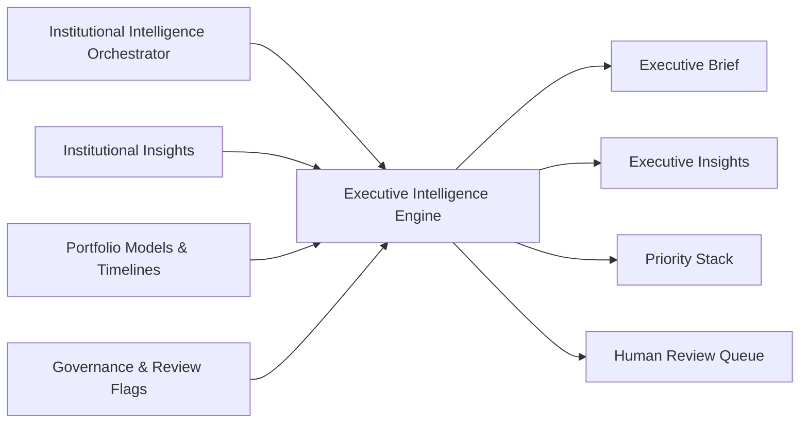
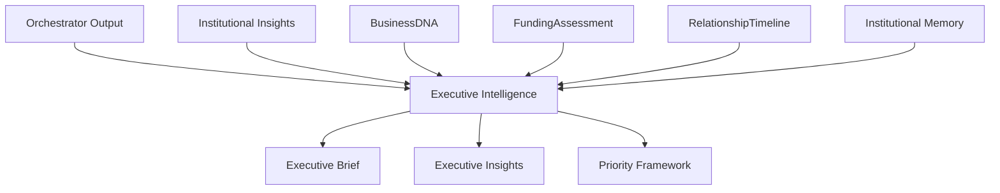
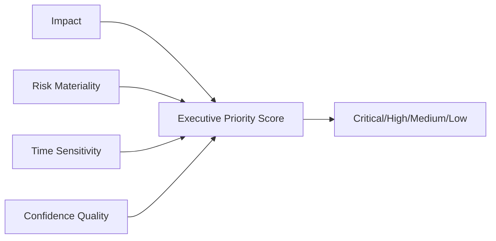
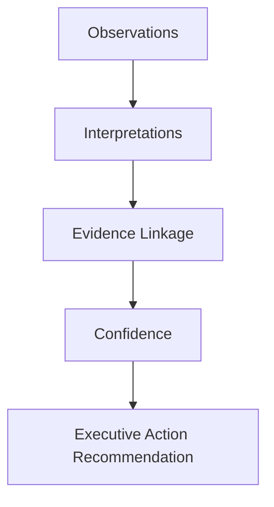

# Executive Intelligence Blueprint

**Version:** 1.0 (Concept)
**Status:** Foundational Architecture
**Owner:** Deepsea Nexus
**Classification:** Internal Intellectual Property

---

## 1. Vision

The Executive Intelligence Engine is the DNOS layer that transforms institutional signals into leadership-grade clarity.

Its vision is to help executives see what matters now, what is changing, where risk is rising, and where strategic attention should move next.

Executive intelligence should not be a dashboard of disconnected metrics. It should be a coherent institutional view that combines business momentum, relationship quality, credit readiness, and governance posture into one explainable leadership narrative.

---

## 2. Purpose

The purpose of the Executive Intelligence Engine is to provide decision-ready, institutionally grounded insight for leadership teams.

It exists to:

- synthesize intelligence outputs into executive-level understanding
- generate a clear executive brief for daily and strategic oversight
- prioritize leadership focus across portfolio, relationship, and risk domains
- surface high-impact opportunities and critical exceptions
- provide confidence-aware recommendations for action
- support governance and committee readiness
- align executive visibility with DNOS orchestration and Institutional Insights

The engine aligns with DNOS Architecture v1.0 by serving as the executive interpretation layer above specialist intelligence and orchestration.

---

## 3. Inputs

The Executive Intelligence Engine should consume structured, orchestrated, and policy-aware intelligence signals.

Primary inputs include:

- Institutional Intelligence Orchestrator outputs
- ranked Institutional Insights and priorities
- BusinessDNA portfolio snapshots
- FundingAssessment summaries
- RelationshipTimeline and engagement progression signals
- Credit Intelligence outputs (CCI, DCS, readiness)
- Opportunity and Relationship Intelligence summaries
- Funding and Structuring recommendations
- governance flags and human review statuses
- Institutional Memory precedent and trend context

The engine should prefer orchestrated and normalized inputs over raw engine fragments.

### Input Flow

---

## 4. Institutional Models Used

The engine should rely on DNOS institutional models and not bypass orchestration.

Core models include:

- **Institutional Insight** — standardized insight unit with confidence, evidence, and priority
- **BusinessDNA** — business-level intelligence used for portfolio context
- **FundingAssessment** — funding direction, confidence, and recommendation context
- **RelationshipTimeline** — lifecycle and engagement momentum signals
- **ExecutiveWorkspaceViewModel** — executive-facing presentation model for workspace delivery
- **Institutional Intelligence Orchestrator outputs** — conflict-resolved and confidence-aggregated intelligence package
- **Institutional Memory** — precedent and historical performance context

The Executive Intelligence Engine should consume these models to produce leadership clarity while preserving explainability and governance traceability.

### Model Interaction

---

## 5. Executive Brief

The Executive Brief is the primary output of the engine and should summarize the institutional state in a concise, leadership-ready format.

It should answer:

- what changed since the last cycle
- what the portfolio status is now
- what opportunities are strongest
- what risks require immediate oversight
- what leadership actions are recommended

### Brief Principles

- concise and decision-focused
- grounded in orchestrated insights
- explicit about uncertainty and confidence
- clear about what is urgent vs important
- suitable for daily operating review and committee prep

The brief should be narrative-first, evidence-backed, and auditable.

---

## 6. Executive Insights

Executive Insights are the high-value interpretations leadership can act on immediately.

Examples include:

- relationship momentum is improving, but outreach bottlenecks are increasing
- credit readiness is strong in one segment but documentation quality is dropping elsewhere
- funding pipeline quality is rising while concentration risk is also rising
- top opportunities are commercial strong but need governance escalation
- operational throughput is stable but decision latency is increasing

Each executive insight should include:

- insight statement
- category
- confidence
- priority
- evidence reference
- recommended executive action

Insights should remain faithful to Institutional Insight definitions and orchestrator conflict-resolution outcomes.

---

## 7. Priority Framework

The Priority Framework organizes executive attention into a ranked action stack.

Priority should be assigned based on:

- institutional impact
- risk materiality
n- time sensitivity
- strategic importance
- confidence reliability
- governance urgency
- cross-engine consistency

### Priority Bands

- **Critical** — immediate executive action or escalation required
- **High** — near-term leadership oversight required
- **Medium** — monitor and direct through team execution
- **Low** — informative context, track over time

### Priority Logic

The framework should help executives spend time on what changes outcomes, not what merely changes metrics.

---

## 8. Confidence Model

Executive confidence is the leadership-level confidence assigned to the synthesized institutional view.

It should reflect:

- orchestrator confidence aggregation quality
- cross-engine agreement level
- evidence depth and reliability
- data recency and completeness
- unresolved conflict severity
- human review dependencies

Executive confidence should be distinct from individual engine confidence and should represent the reliability of the overall executive brief.

### Confidence Bands

- **90-100**: highly reliable executive view
- **75-89**: reliable with limited uncertainty
- **50-74**: directionally useful but requires caution
- **0-49**: insufficient reliability, review required

Confidence must be shown alongside the brief and priorities, not hidden in backend logic.

---

## 9. Explainability

The Executive Intelligence Engine must remain explainable at every stage.

Each executive output should support:

- **Observation Layer**: what the system saw
- **Interpretation Layer**: what the system concluded
- **Evidence Layer**: what supports the conclusion
- **Confidence Layer**: how reliable the conclusion is
- **Action Layer**: what leadership should do next

The engine should never generate leadership recommendations without traceable evidence and a visible confidence context.

### Explainability Chain

Explainability should support executive trust, committee scrutiny, and audit resilience.

---

## 10. Human Review

Human review is required when executive interpretation includes unresolved conflicts, low confidence, or policy-sensitive implications.

### Review Triggers

Human review should be triggered when:

- orchestrator conflict is unresolved
- executive confidence falls below threshold
- governance or policy exception is likely
- insight priority is critical with weak evidence
- strategic recommendation carries material downside risk
- narrative requires judgment beyond modeled signals

### Review Workflow

1. surface executive brief and critical insights
2. show confidence and unresolved conflicts
3. attach evidence and policy context
4. request executive or committee judgment
5. capture decision, rationale, and overrides
6. route outcomes to Institutional Memory and learning loops

Human review is a control feature, not a fallback failure.

---

## 11. AI Boundaries

The Executive Intelligence Engine must operate within strict institutional boundaries.

It should not:

- make final approval decisions
- hide uncertainty or conflict
- bypass policy or governance controls
- rewrite orchestrator findings without traceability
- fabricate trends or outcomes from incomplete evidence

It should:

- summarize institutional state with clarity
- preserve evidence and confidence transparency
- prioritize leadership focus responsibly
- escalate ambiguous cases to humans
- remain auditable and policy-aligned

The engine’s role is executive guidance, not executive authority.

---

## 12. Future Learning

The Executive Intelligence Engine should improve through verified decisions and leadership feedback.

Learning should refine:

- executive brief relevance and clarity
- priority ranking quality
- confidence calibration
- risk and opportunity framing
- escalation timing
- narrative usefulness in committee contexts

Learning sources may include:

- executive overrides
- committee outcomes
- strategic decision outcomes
- missed-priority incidents
- false-positive and false-negative escalations
- feedback from RM and portfolio teams

Learning updates should remain explainable, versioned, and reversible.

---

## 13. Roadmap

A practical roadmap for Executive Intelligence should evolve in stages.

### Phase 1 - Deterministic Executive Briefing

- orchestrator-driven brief generation
- ranked executive insights
- priority framework output
- confidence and evidence visibility

### Phase 2 - Governance-Aware Executive Intelligence

- tighter committee workflow integration
- stronger exception and escalation handling
- enhanced audit-ready narrative packs

### Phase 3 - Portfolio Pattern Intelligence

- trend detection across opportunities, relationships, and risk domains
- better strategic signal extraction from Institutional Memory
- improved executive early-warning capability

### Phase 4 - Adaptive Leadership Guidance

- feedback-calibrated prioritization
- context-aware narrative adaptation by role and committee
- stronger alignment between strategic intent and operational execution

### Phase 5 - Institutional Executive Operating Layer

- continuous executive intelligence across markets and products
- richer cross-engine strategic synthesis
- robust governance and learning integration at scale

---

## Operating Summary

The Executive Intelligence Engine is the leadership interpretation layer of DNOS.

It converts orchestrated institutional intelligence into clear executive briefs, ranked priorities, and explainable guidance that executives can act on with confidence.

In DNOS, executive intelligence is not reporting. It is institutional direction with evidence, confidence, and governance discipline.
