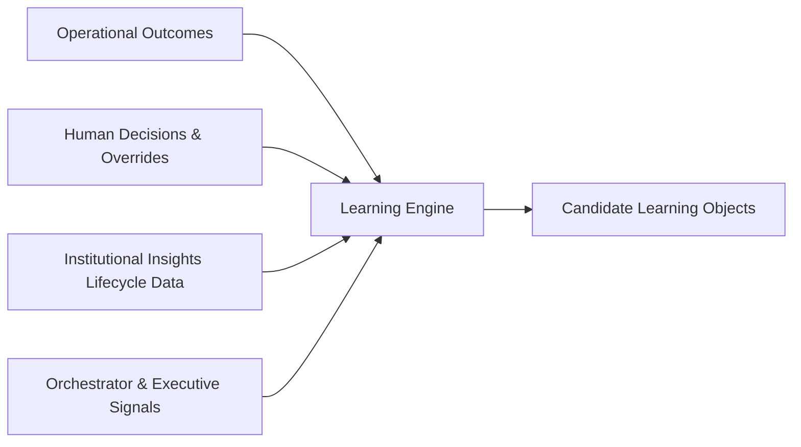
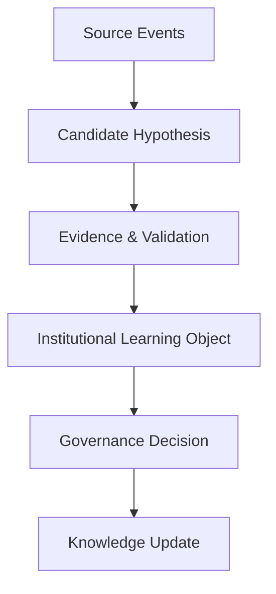
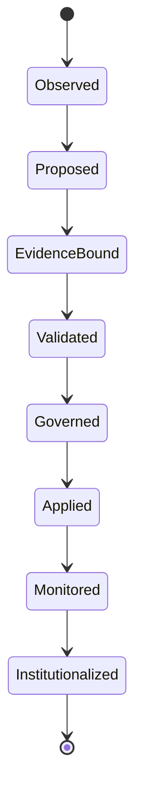
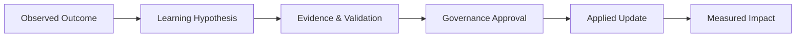
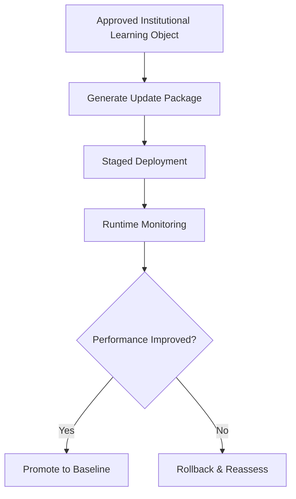

# Learning Engine Blueprint

**Version:** 1.0 (Concept)
**Status:** Foundational Architecture
**Owner:** Deepsea Nexus
**Classification:** Internal Intellectual Property

---

## 1. Vision

The Learning Engine is the DNOS capability that turns verified outcomes into institutional improvement.

Its vision is to ensure every meaningful interaction, decision, and result makes the institution more intelligent over time. Learning should not be accidental or opaque. It should be structured, governed, explainable, and aligned to institutional objectives.

The Learning Engine should help Deepsea evolve continuously while preserving accountability, human oversight, and policy discipline.

---

## 2. Purpose

The purpose of the Learning Engine is to capture, validate, and operationalize institutional learning across all DNOS intelligence engines.

It exists to:

- ingest verified outcomes and human feedback
- convert observations into durable learning objects
- validate whether a candidate learning is trustworthy
- route approved learnings into governed model and rule updates
- improve confidence calibration and prioritization quality
- preserve full explainability and audit lineage for every learning update
- synchronize learning with Institutional Insights, Orchestrator behavior, and Executive Intelligence needs

The Learning Engine aligns with DNOS Architecture v1.0 by acting as a controlled improvement loop, not an uncontrolled auto-optimization layer.

---

## 3. Sources of Learning

The Learning Engine should consume diverse, verified, and institutionally relevant sources.

Primary sources include:

- approved deals and rejected deals
- defaults, recoveries, and collections outcomes
- legal and regulatory outcomes
- committee decisions and override rationales
- relationship progression outcomes
- funding execution outcomes
- opportunity conversion outcomes
- executive review outcomes
- orchestrator conflict-resolution outcomes
- Institutional Insight lifecycle outcomes
- RM and analyst feedback
- policy exceptions and governance notes

Learning sources should be weighted by reliability, recency, and outcome clarity.

### Source Flow

---

## 4. Institutional Learning Object

The Institutional Learning Object (ILO) is the core unit used by the Learning Engine to represent a validated lesson.

An ILO should capture:

- learning subject and scope
- source events and evidence references
- affected engines and model domains
- confidence in the learning itself
- expected impact type (accuracy, prioritization, calibration, etc.)
- risk profile of applying the learning
- governance tier and approval requirement
- versioning and rollout metadata

The ILO is to learning what Institutional Insight is to reasoning: a structured, explainable, reusable unit.

### ILO Shape

---

## 5. Learning Lifecycle

Every Institutional Learning Object should move through a defined lifecycle.

### Lifecycle Stages

1. **Observed** — relevant outcome or pattern is detected
2. **Proposed** — candidate learning hypothesis is created
3. **Evidence-Bound** — supporting evidence is attached and traceable
4. **Validated** — statistical, domain, and policy checks are passed
5. **Governed** — approval routed by risk tier
6. **Applied** — controlled rollout to affected engines/models
7. **Monitored** — impact and side effects tracked
8. **Institutionalized** — learning accepted into long-term knowledge and standards

### Lifecycle Diagram

The lifecycle should support rollback paths whenever post-deployment performance degrades.

---

## 6. Validation Rules

The Learning Engine should apply strict validation before any learning is eligible for deployment.

Validation rules should include:

- **Outcome Verification**: learning must be tied to verifiable outcomes
- **Evidence Sufficiency**: source evidence must be complete and traceable
- **Signal Consistency**: no unresolved contradictions in critical signals
- **Policy Compatibility**: learning must comply with institutional policy and governance boundaries
- **Bias Screening**: potential bias or unfair impact must be assessed
- **Materiality Check**: learning impact must be significant enough for change
- **Stability Check**: learning should hold across a meaningful sample, not isolated noise
- **Safety Gate**: high-risk updates require stronger evidence and stricter approval

A learning candidate that fails validation should be rejected or queued for additional evidence.

---

## 7. Governance

Governance ensures learning is controlled, accountable, and safe.

### Governance Principles

- no critical learning update without human approval
- approval tier should match learning risk and impact
- all changes must be versioned and reversible
- every learning decision must be auditable
- governance must cover both model behavior and rule behavior

### Governance Tiers

- **Tier 1 (Low Risk)**: calibration or threshold tuning with limited impact
- **Tier 2 (Medium Risk)**: logic adjustments affecting prioritization or confidence
- **Tier 3 (High Risk)**: changes affecting recommendations, escalations, or governance posture

### Approval Authorities

- Tier 1: designated AI leadership delegate
- Tier 2: domain committee or cross-functional governance panel
- Tier 3: executive governance authority (with committee evidence)

The Learning Engine should enforce governance by design, not by after-the-fact review.

---

## 8. Explainability

Learning must remain explainable before and after deployment.

For every applied ILO, the system should answer:

- what changed
- why it changed
- what evidence justified the change
- what confidence supports the change
- what risks were considered
- who approved the change
- what impact was expected
- what impact was observed

### Explainability Chain

Explainability should support engineers, risk teams, committees, and executive oversight equally.

---

## 9. Knowledge Updates

Knowledge updates are the operational outputs of approved learning.

The Learning Engine should update:

- confidence calibration rules
- priority weighting logic
- insight categorization mappings
- orchestrator conflict-resolution weights
- executive narrative ranking signals
- threshold definitions for human review
- Institutional Memory tags and retrieval patterns

Updates should be:

- versioned
- scoped
- tested
- staged
- reversible
- monitored

### Update Flow

Knowledge updates should improve institutional quality without introducing hidden instability.

---

## 10. Future Learning

The Learning Engine should evolve from static retrospective updates toward adaptive institutional learning.

Future directions include:

- stronger cross-engine learning between credit, relationship, opportunity, and funding domains
- richer learning from executive decisions and strategic outcomes
- better alignment between insight quality and business outcomes
- more precise confidence recalibration
- faster but still governed update cycles
- deeper memory-driven pattern retrieval for rare scenarios

Future learning must remain policy-bound, evidence-first, and human-governed.

---

## 11. Roadmap

A practical roadmap for the Learning Engine should evolve in stages.

### Phase 1 - Structured Learning Foundation

- introduce Institutional Learning Object format
- implement deterministic lifecycle and validation gates
- establish governance tiers and approval routing
- create baseline explainability and audit trail

### Phase 2 - Controlled Operational Updates

- automate low-risk calibration updates under governance
- standardize staged rollout and rollback mechanics
- improve impact monitoring across engines
- connect learning outputs to Institutional Memory updates

### Phase 3 - Cross-Engine Learning Coordination

- coordinate learning updates across orchestrator and specialist engines
- improve conflict-resolution and confidence aggregation behavior
- align learning outputs with executive-priority outcomes

### Phase 4 - Executive-Aligned Institutional Learning

- integrate leadership feedback loops into learning object scoring
- improve strategic signal learning for portfolio and governance oversight
- strengthen learning transparency for committees and executive reporting

### Phase 5 - Adaptive DNOS Learning Layer

- mature toward continuous, governed, institution-wide learning
- preserve explainability and human control at scale
- support multi-market and multi-product learning patterns
- maintain stable, auditable intelligence evolution as a core institutional advantage

---

## Operating Summary

The Learning Engine is the institutional improvement layer of DNOS.

It turns verified outcomes into governed knowledge updates that improve intelligence quality across the platform while preserving explainability, accountability, and human control.

In DNOS, learning is not a background process. It is a first-class institutional capability.
