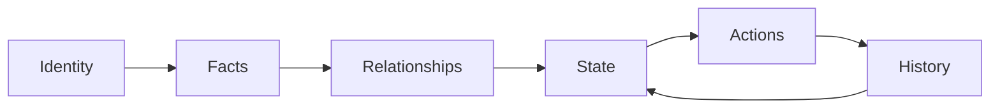

# ADR-002: Universal Lifecycle

## Status
Accepted

## Date
2026-07-10

## Purpose
Define the Universal Lifecycle that every Institutional Object in DNOS follows.

DNOS does not treat data as isolated files or records. It treats business entities as Institutional Objects that must be understood, governed, and operated consistently across modules. The Universal Lifecycle provides that common operating contract.

## Decision
Every Institutional Object in DNOS must implement the same six lifecycle stages:

1. Identity
2. Facts
3. Relationships
4. State
5. Actions
6. History

This model is mandatory for all domains and modules.

## Universal Lifecycle Stages

### 1. Identity
Every object has a permanent institutional identity.

Identity is immutable and guarantees continuity through workflow, enrichment, and ownership transitions.

Examples:

- Document
- Client
- Deal
- Facility
- Bank
- Counterparty

### 2. Facts
Every object accumulates verified business facts.

Facts are evidence-backed attributes and measurements used for operations, controls, and decisions.

Examples:

- Company Name
- Amount
- Currency
- Expiry Date
- Risk Rating

### 3. Relationships
Objects are connected to other Institutional Objects.

Relationships provide institutional context and enable multi-object reasoning.

Examples:

- Document -> Client
- Client -> Deal
- Deal -> Facility
- Facility -> Bank

### 4. State
Objects move through defined lifecycle states.

State indicates current operational posture and determines allowed transitions.

Examples:

- Created
- Uploaded
- Under Review
- Approved
- Rejected
- Archived

### 5. Actions
Humans and automated services perform actions on Institutional Objects.

Actions mutate object state, facts, or relationships under policy and authorization controls.

Examples:

- Upload
- Approve
- Reject
- Assign
- Archive
- Link
- Replace

### 6. History
Every action becomes part of the permanent institutional audit trail.

History is append-only and provides accountability, explainability, and regulatory traceability.

## Lifecycle Diagram

Interpretation:

- The first five stages establish and operate the object.
- Every action is recorded in History.
- History continuously informs future State transitions.

## Why Every DNOS Module Must Follow This Lifecycle

All DNOS modules must use the same lifecycle because institutional operations are cross-functional and interdependent.

### 1. Cross-module consistency
Objects routinely pass through ORACLE, SENTINEL, HELIOS, ATLAS Core, and adjacent modules. A shared lifecycle prevents semantic drift and mismatched assumptions.

### 2. Workflow interoperability
End-to-end workflows span Documents, Clients, Deals, Facilities, Banks, and Counterparties in a single path. Uniform lifecycle semantics make orchestration deterministic.

### 3. Governance and control integrity
Risk, approval, and compliance controls require common checkpoints. Shared stages provide stable control boundaries across all object types.

### 4. Unified auditability
Institutional decisioning requires complete lineage. A common History stage guarantees that every object can be audited with the same evidentiary standard.

### 5. Scalable architecture evolution
New capabilities can be added without changing foundational semantics. Teams extend object-specific details while preserving platform-level lifecycle invariants.

## Architectural Implications

- New object models must explicitly define Identity, Facts, Relationships, State, Actions, and History.
- Module implementations may extend attributes, but cannot bypass lifecycle stages.
- Automation, AI enrichment, and workflow rules must operate through lifecycle transitions, not around them.

## Related Decisions

- ADR-001: Institutional Object Model
