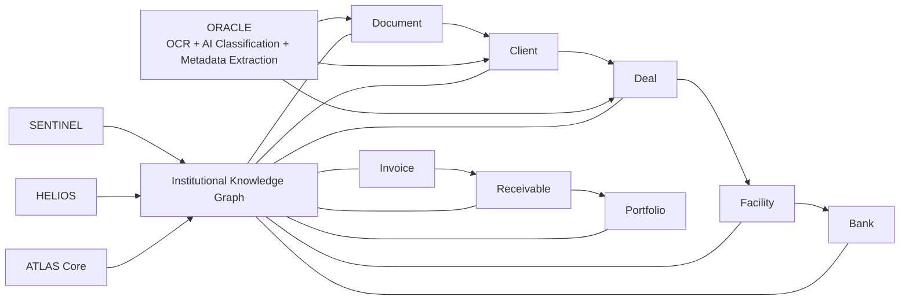

# ADR-003: Knowledge Graph

## Status
Accepted

## Date
2026-07-10

## Purpose
Define the Institutional Knowledge Graph used by the Deepsea Nexus Operating System (DNOS).

## Context
Traditional enterprise systems frequently model business context as isolated records and file attachments. This model limits explainability, weakens decision quality, and prevents consistent cross-domain reasoning.

DNOS adopts an institutional model where relationships are first-class architecture primitives. Rather than storing disconnected records, DNOS stores connected Institutional Objects and their governed links.

## Decision
DNOS stores relationships rather than isolated records.

The Institutional Knowledge Graph is the canonical representation of business context across modules. Documents, entities, transactions, obligations, and operational artifacts are represented as connected Institutional Objects with traceable facts and lifecycle history.

## Core Concepts

### Institutional Objects
Institutional Objects are the primary nodes in DNOS.

They represent durable business entities such as:

- Documents
- Clients
- Deals
- Facilities
- Banks
- Invoices
- Receivables
- Portfolios

Each object follows the universal lifecycle and can be reasoned about by policy, workflow, treasury, and intelligence engines.

### Institutional Facts
Institutional Facts are verified attributes attached to Institutional Objects.

Examples include:

- Company name
- Approved amount
- Currency
- Effective date
- Risk rating
- Document type

Facts are evidence-backed, versionable, and attributable to a source.

### Institutional Relationships
Institutional Relationships are explicit semantic links between objects.

Relationships define business context and transitive dependency. Examples:

- Document -> Client
- Client -> Deal
- Deal -> Facility
- Facility -> Bank
- Invoice -> Receivable
- Receivable -> Portfolio

Each relationship includes role semantics and can be constrained by policy and time validity.

### Knowledge Graph
The Knowledge Graph is the composite graph of Institutional Objects, Facts, and Relationships.

It provides:

- Unified institutional context
- Cross-domain dependency visibility
- Traceable evidence lineage
- Structured input for downstream reasoning and decisions

### Reasoning
Reasoning is the process of deriving additional context or implications from graph structure and validated facts.

Examples:

- Detecting concentration risk through shared counterparties
- Inferring exposure paths from receivable to portfolio
- Identifying missing dependency links before approvals

Reasoning must operate on graph data, not on disconnected file payloads.

### Decision Support
Decision Support is produced by evaluating graph context under policy, risk, and operational constraints.

Outcomes include:

- Approval recommendations
- Escalation triggers
- Structuring guidance
- Treasury optimization options

Decision support must be explainable through graph lineage.

## Engine Responsibilities

### ORACLE enrichment
ORACLE enriches the Knowledge Graph through document intelligence pipelines:

- OCR: converts binary documents into machine-readable text signals.
- AI Classification: determines document type and semantic intent.
- Metadata Extraction: extracts structured facts and relationship candidates.

ORACLE does not terminate in standalone file output. It produces graph-ready enrichments that attach to Institutional Objects and relationships with provenance metadata.

### SENTINEL consumption
SENTINEL consumes graph context for institutional risk computation.

Instead of directly reading raw documents, SENTINEL evaluates:

- Object facts
- Relationship topology
- State transitions
- Historical controls and exceptions

### HELIOS consumption
HELIOS consumes graph knowledge to optimize treasury outcomes.

It uses graph-level relationships among deals, facilities, receivables, and portfolios to evaluate liquidity and execution options under constraints.

### ATLAS Core consumption
ATLAS Core consumes graph context to orchestrate workflows and coordination.

It routes actions and approvals using object state, relationship dependencies, and evidence completeness rather than ad hoc document reads.

## Knowledge Graph Diagram

## Architectural Implications

- New capabilities must publish facts and relationships into the graph model.
- Direct file-only processing paths are non-compliant for institutional decisioning.
- Engine outputs must remain explainable through object and relationship lineage.
- Graph governance is mandatory for consistency, traceability, and policy enforcement.

## Consequences

Positive outcomes:

- Stronger cross-module consistency and interoperability.
- Better decision quality through connected context.
- Improved explainability and audit readiness.

Trade-offs:

- Requires disciplined ontology and relationship governance.
- Increases modeling rigor and metadata quality requirements.
- Demands lifecycle-aware enrichment pipelines.

## Related Decisions

- ADR-001: Institutional Object Model
- ADR-002: Universal Lifecycle
