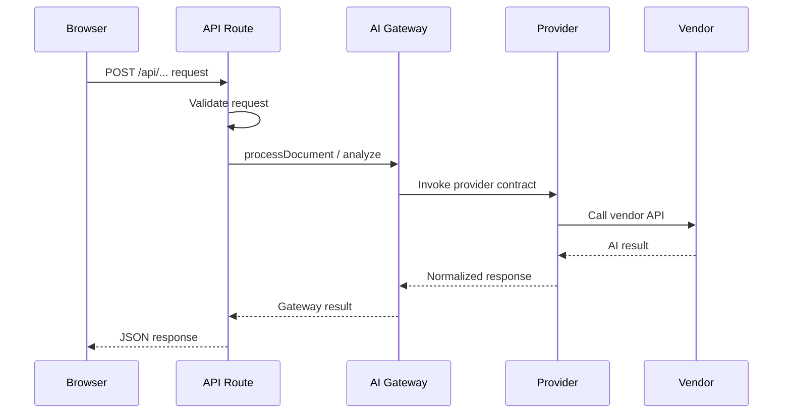

# ADR-004: AI Gateway

## Status
Accepted

## Date
2026-07-10

## Problem Statement

Browser-to-AI calls are prohibited because they expose vendor credentials, weaken control over request routing, and bypass the institutional security boundary required for DNOS.

If the browser can call an AI vendor directly, then:

- API keys may be exposed to client-side code or browser bundles.
- Requests are harder to audit and govern centrally.
- Rate limiting and abuse controls become inconsistent.
- Vendor-specific behavior leaks into user-facing application code.
- The platform becomes harder to change as AI providers evolve.

DNOS requires AI access to be controlled, observable, and replaceable.

## Decision

All AI providers must be accessed through a server-side gateway.

The browser must never call AI vendors directly. Instead, browser-originated workflows must route through a server-side API boundary that delegates to the AI Gateway, which in turn invokes the selected provider implementation.

## Architecture

The AI Gateway architecture is composed of the following layers:

- Browser
- API Route
- AI Gateway
- Provider
- Vendor

### Layer Responsibilities

- Browser: initiates user actions and submits requests to the application server.
- API Route: validates input, applies application boundary rules, and forwards the request to the gateway.
- AI Gateway: central orchestration layer that normalizes AI access and hides vendor-specific details.
- Provider: internal implementation of a vendor contract.
- Vendor: the external AI service or model provider.

## Mermaid Sequence Diagram

## Benefits

### Security
Server-side AI access keeps vendor credentials out of the browser and enforces a trusted execution boundary.

### Secret management
API keys and secrets remain server-managed and can be rotated without client-side deployment changes.

### Auditing
A gateway provides a single point for logging, tracing, and review of AI usage across the platform.

### Rate limiting
Traffic control can be enforced centrally before requests reach a provider.

### Provider independence
Application code depends on the gateway contract rather than any specific vendor implementation.

### Future extensibility
New AI providers can be introduced without changing browser code or business workflows.

## Consequences

### Slightly more infrastructure
The platform must maintain an additional server-side layer for routing and orchestration.

### Significantly better long-term maintainability
The added structure creates a stable foundation for security, governance, testing, and provider replacement over time.
