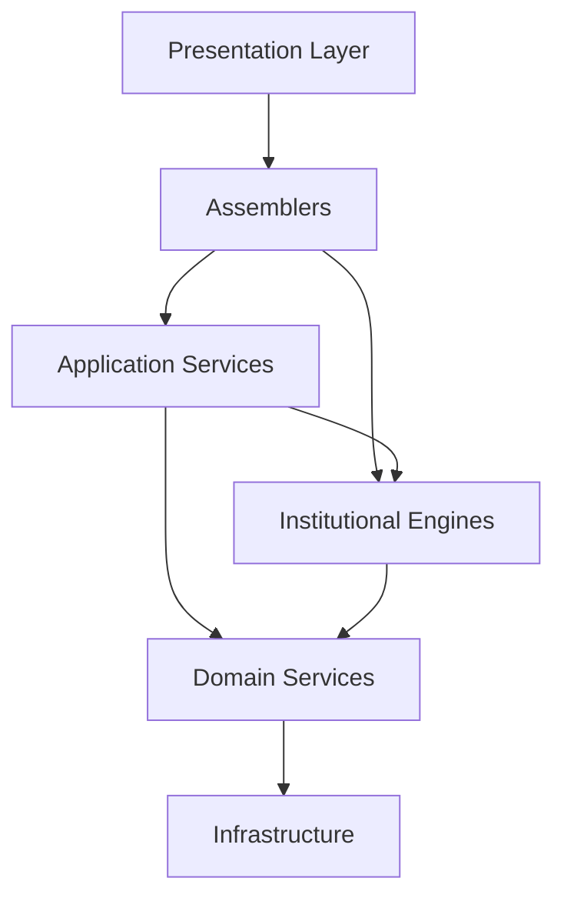
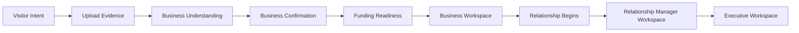
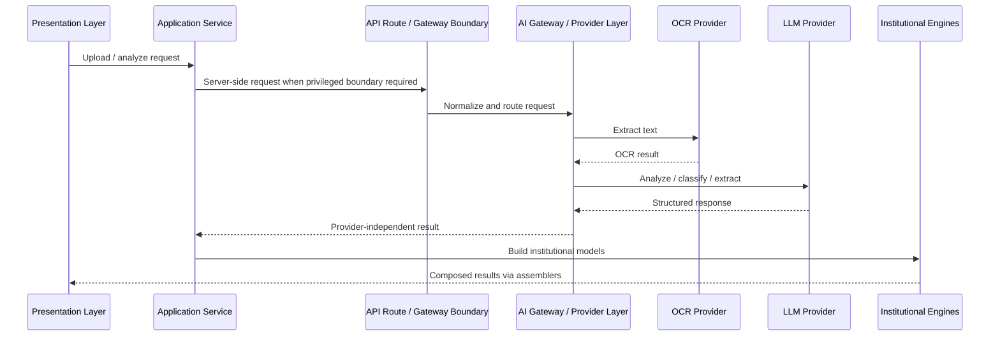

# DNOS Architecture v1.0

## 1. Executive Summary

Deepsea Nexus Operating System (DNOS) is the institutional operating substrate for Deepsea. It is not a collection of disconnected screens or services. It is a governed system that converts evidence into knowledge, knowledge into decisions, and decisions into durable institutional memory.

DNOS v1.0 defines the architecture baseline for all future engineering work. It establishes:

- Institutional Objects as the primary architectural unit.
- A universal lifecycle for every governed object.
- A layered architecture that separates presentation, assembly, application orchestration, engines, domain logic, and infrastructure.
- Server-side boundaries for privileged AI and OCR integrations.
- Workspace-specific presentation models for customers, relationship managers, and executives.
- Deterministic engines and assemblers that keep business logic out of UI code.

This document is the canonical engineering reference for implementation completed through Milestone M4. It should be used to guide future architecture, feature delivery, reviews, and refactoring.

## 2. Vision

DNOS exists to become Deepsea's institutional memory and operating system.

Its purpose is to ensure that:

- business context is preserved across teams, workflows, and time,
- evidence becomes reusable institutional knowledge,
- relationships are tracked as durable assets,
- AI augments operations without bypassing governance,
- decisioning remains explainable, auditable, and composable.

The long-term vision is a platform where customer understanding, risk posture, workflow state, relationship context, and executive insight are all derived from shared institutional models rather than duplicated in local feature silos.

## 3. Design Principles

### Architecture before implementation
Major behavior must be designed before it is coded.

### Institutional consistency
Every module must align to shared object, lifecycle, and naming rules.

### Knowledge over documents
Documents are evidence inputs. The durable asset is the knowledge extracted and governed from them.

### UI is a projection, not a source of truth
Presentation layers render composed view models. They do not own domain logic, persistence, or orchestration.

### Vendor isolation
OCR, LLM, storage, and other external dependencies are accessed behind internal contracts.

### Human accountability with AI augmentation
AI enriches understanding and accelerates review. It does not replace policy, ownership, or control.

### Small reversible increments
The platform evolves through milestone slices that preserve long-term coherence.

### Documentation is part of the product
Architecture documents, ADRs, and sprint records are release artifacts, not optional follow-up work.

## 4. Layered Architecture

DNOS is organized as an intentionally layered system.



### Presentation Layer
Purpose: render screens, flows, and role-specific workspaces.

Responsibilities:

- collect user intent,
- display composed view models,
- manage local interaction state,
- avoid embedding business orchestration.

Boundaries:

- no direct database access,
- no vendor-specific AI/OCR integration,
- no domain calculations beyond local UI state.

### Assemblers
Purpose: transform institutional models into UI-ready view models.

Responsibilities:

- compose presentation data from Business DNA, funding assessments, and relationship timelines,
- provide stable shapes for business, relationship, and executive workspaces,
- keep formatting and screen-oriented data mapping out of domain and UI layers.

Boundaries:

- no persistence,
- no workflow orchestration,
- no vendor access.

### Application Services
Purpose: coordinate cross-layer use cases.

Responsibilities:

- orchestrate upload, analysis, and assessment flows,
- coordinate repositories, pipelines, engines, and providers,
- return application-level results to the presentation layer.

Current examples:

- `BusinessUnderstandingService`
- `FundingAssessmentService`

Boundaries:

- may coordinate other layers,
- must not become a dumping ground for domain rules that belong in engines,
- must not contain presentation logic.

### Institutional Engines
Purpose: deterministically construct or enrich institutional models.

Responsibilities:

- build Business DNA,
- build and extend relationship timelines,
- execute repeatable institutional transformations.

Current examples:

- `BusinessDNAEngine`
- `RelationshipTimelineEngine`

Boundaries:

- no UI concerns,
- no persistence concerns,
- no infrastructure details beyond consumed contracts.

### Domain Services
Purpose: encapsulate domain-specific behavior and provider-independent business logic.

Responsibilities:

- classification,
- metadata extraction,
- document processing workflow steps,
- facility and assessment rules.

Boundaries:

- should depend on contracts, not vendors,
- should remain reusable outside any single workspace.

### Infrastructure
Purpose: provide external connectivity and storage mechanisms.

Responsibilities:

- Supabase storage and data access,
- AI and OCR providers,
- queue execution,
- API routes and gateways,
- runtime configuration and secrets.

Boundaries:

- infrastructure should not own business meaning,
- infrastructure projects business intent, it does not define it.

## 5. Folder Structure

The current implementation is organized around product surfaces, institutional core models, infrastructure contracts, and workspace composition.

```text
app/
  page.tsx
  executive/page.tsx
  rm/page.tsx
  atlas/
  api/oracle/ocr/route.ts

atlas-core/
  domain/
  documents/
  evaluation/
  commercial/
  workflow/
  services/

components/
  atlas/
  *.tsx shared UI primitives

lib/
  ai/
  business/
  documents/
  knowledge/
  relationship/
  supabase/
  workspaces/

public/
docs/
```

### Folder responsibilities

- `app/`: route entry points and App Router surfaces.
- `atlas-core/`: institutional and engine-oriented core domain models.
- `components/`: reusable UI primitives and page-supporting components.
- `lib/business/`: application services for business understanding and funding assessment.
- `lib/documents/`: upload, pipeline, provider contracts, workers, and repositories.
- `lib/knowledge/`: knowledge attributes, Business DNA models, and engines.
- `lib/relationship/`: relationship event, timeline, and timeline engine foundations.
- `lib/workspaces/`: presentation view models and assemblers.
- `lib/ai/`: AI gateway boundary and provider-facing orchestration.
- `lib/supabase/`: server and browser client boundaries for data/storage access.
- `docs/`: architecture, product, sprint, and operational references.

## 6. Business Flow

The current business flow implemented through M4 begins at the public homepage and progresses toward institutional workspaces.



### Flow interpretation

1. A visitor selects a business goal on the public homepage.
2. ORACLE begins the first business conversation.
3. A document upload triggers business understanding orchestration.
4. Extracted knowledge is confirmed with the customer.
5. Funding intent is captured.
6. A Business Workspace is created.
7. The experience transitions into a relationship-led operating path.
8. Relationship and executive workspaces consume institutional projections of the same underlying business context.

## 7. AI Flow

AI is a controlled enrichment capability, not an ungoverned browser-side feature.



### AI boundary rules

- The browser must not call AI vendors directly.
- Provider details must remain behind contracts and gateways.
- AI outputs must be converted into governed institutional artifacts.
- OCR and LLM results are intermediate evidence, not final institutional truth by themselves.

## 8. Institutional Knowledge

Institutional knowledge in DNOS is represented through structured, confidence-aware models rather than loose text or isolated document metadata.

Current knowledge foundation includes:

- `KnowledgeAttribute<T>`
- `BusinessDNA`
- `BusinessDNAEngine`

### KnowledgeAttribute
A reusable knowledge atom with:

- `value`
- `confidence`
- `source`
- `updatedAt`

This enforces provenance and confidence as first-class concerns.

### Business DNA
Business DNA is the initial institutional representation of a business. It organizes knowledge into:

- Identity
- Business
- Financial
- Behaviour
- Relationship
- Intelligence

### Knowledge responsibility

- Application services collect evidence and invoke orchestration.
- Engines convert results into institutional models.
- Assemblers project those models into workspace-ready shapes.

## 9. Relationship Timeline

Relationship progress is modeled explicitly as an ordered series of events.

Current relationship foundation includes:

- `RelationshipEvent`
- `RelationshipTimeline`
- `RelationshipTimelineEngine`

### Purpose
The relationship timeline gives DNOS a durable history of customer progression from first understanding through engagement and future lifecycle events.

### Engine responsibilities

- `build()`: create a timeline from a business identifier and event set
- `append()`: add a new event deterministically
- `sort()`: maintain canonical event order

### Architectural role
The relationship timeline is the bridge between business understanding and relationship management. It allows future RM, executive, and portfolio experiences to consume the same institutional progression model.

## 10. Workspaces

DNOS workspaces are role-specific projections of shared institutional context.

Current workspace surfaces include:

- Public Business Workspace experience on the homepage
- Relationship Manager Workspace at `app/rm/page.tsx`
- Executive Workspace at `app/executive/page.tsx`

### Business Workspace
Purpose: present first customer-facing institutional context.

Includes:

- business profile,
- funding readiness,
- documents,
- relationship timeline,
- AI advisor narrative.

### Relationship Workspace
Purpose: enable relationship managers to act on business intelligence and customer progression.

Includes:

- portfolio KPIs,
- relationship card,
- relationship coach guidance,
- tasks and next actions.

### Executive Workspace
Purpose: give founders and senior leadership a concise operating brief.

Includes:

- executive KPIs,
- AI chief of staff narrative,
- portfolio-level quick actions,
- priority framing.

## 11. Presentation Layer

The presentation layer is implemented through Next.js App Router pages and React components.

### Current presentation characteristics

- Route-driven pages under `app/`
- Local React state for progressive customer experiences
- Workspace-specific pages for RM and executive roles
- Shared components for reusable UI primitives

### Responsibilities

- collect user interactions,
- manage local interaction state,
- render accessible, responsive experiences,
- consume assembled view models.

### Boundaries

Presentation code must not:

- contain reusable business orchestration,
- talk directly to repositories where an application service should mediate,
- embed vendor-specific integration logic,
- redefine institutional models locally.

## 12. Assemblers

Assemblers are the presentation composition boundary.

Current assembler set:

- `BusinessWorkspaceAssembler`
- `RelationshipWorkspaceAssembler`
- `ExecutiveWorkspaceAssembler`

### Purpose
Assemblers convert institutional inputs into view models required by a specific workspace.

### Input sources

- Business DNA
- Funding Assessment
- Relationship Timeline

### Output targets

- `BusinessWorkspaceViewModel`
- `RelationshipWorkspaceViewModel`
- `ExecutiveWorkspaceViewModel`

### Rules

- deterministic only,
- no persistence,
- no provider calls,
- no UI rendering,
- no domain mutation.

## 13. Application Services

Application services coordinate multi-step use cases at the boundary between UI and institutional logic.

### Current application services

#### BusinessUnderstandingService
Responsibilities:

- validate uploaded file,
- upload document,
- create document record,
- invoke document pipeline,
- obtain classification and extracted metadata,
- return a business understanding result.

#### FundingAssessmentService
Responsibilities:

- produce deterministic indicative funding assessments,
- map business context to recommended facility, risk level, turnaround, and recommendation.

### Application service rules

- orchestrate, do not over-model presentation,
- delegate deterministic institutional transformations to engines,
- keep vendor details behind infrastructure or provider boundaries.

## 14. Institutional Engines

Institutional engines build durable platform knowledge and state from orchestrated inputs.

### Current engines

#### BusinessDNAEngine
Responsibilities:

- `build(result)`
- `merge(existingDNA, result)`

It converts business understanding outputs into a complete Business DNA object.

#### RelationshipTimelineEngine
Responsibilities:

- `build()`
- `append()`
- `sort()`

It builds and maintains canonical relationship event sequences.

### Engine rules

- deterministic logic only unless explicitly designed otherwise,
- no UI concerns,
- no storage ownership,
- no page-specific formatting.

## 15. Domain Services

Domain services encapsulate stable domain behavior that should not live inside UI or infrastructure.

### Current examples

- `DocumentClassificationService`
- `DocumentMetadataExtractionService`
- `DocumentPipeline`
- `DocumentWorker`
- queue service and provider contracts

### Role of domain services

- transform evidence into structured outcomes,
- isolate workflow stages,
- separate domain orchestration from transport and rendering.

### Boundary guidance

- domain services should not know about page layouts,
- domain services should avoid direct vendor coupling when a provider contract exists,
- domain services should remain reusable by future APIs, RM flows, or batch processes.

## 16. Infrastructure

Infrastructure provides the transport, storage, runtime, and integration boundaries used by higher layers.

### Current infrastructure elements

- Supabase browser and server clients
- document storage bucket integration
- document repository abstraction
- OCR provider implementations
- LLM provider implementations
- AI gateway boundary
- API routes such as `/api/oracle/ocr`

### Infrastructure rules

- infrastructure is replaceable,
- secrets remain server-side,
- APIs validate and normalize at the boundary,
- provider implementations hide vendor specifics from upper layers.

## 17. Engineering Rules

The following rules are mandatory for DNOS engineering work.

1. No business logic inside UI.
2. No direct vendor dependencies in presentation code.
3. No direct database access from UI when a service or repository boundary is required.
4. Institutional Objects are the architecture unit, not files or ad hoc rows.
5. Documents are evidence, not the durable business asset.
6. Every important change should preserve provenance, confidence, and auditability.
7. New features should align to the universal lifecycle.
8. Architecture documents and ADRs must evolve with implementation.
9. Provider pattern, repository pattern, and composition over coupling remain default rules.
10. Security boundaries must keep privileged AI and OCR calls out of the browser.

## 18. Naming Standards

DNOS naming must be explicit, layered, and role-accurate.

### Architecture naming

- `*Service`: application or domain orchestration boundary.
- `*Engine`: deterministic transformation or institutional logic boundary.
- `*Provider`: vendor-backed or adapter-backed implementation of a contract.
- `*Repository`: persistence access abstraction.
- `*ViewModel`: presentation contract for a workspace or screen.
- `*Assembler`: presentation composition layer.
- `*Event`: immutable timeline or history unit.
- `*Timeline`: ordered institutional history stream.

### Domain naming

- Prefer business language over transport language.
- Prefer object-centric names over storage-centric names.
- Avoid vague utility names for domain-bearing code.

### File naming

- Use descriptive camelCase file names in `lib/`.
- Use route-based `page.tsx` in `app/`.
- Keep naming consistent with public class/interface responsibility.

## 19. Git & Release Standards

### Git standards

- Small, reviewable commits
- Meaningful commit messages
- Review `git status` before commit
- No temporary files or generated noise
- Protect architectural integrity during incremental delivery

### Release standards

Every release slice should include:

- implemented code,
- validation,
- architecture updates when boundaries change,
- sprint notes where relevant,
- evidence that lint and TypeScript remain clean.

### Release philosophy

Releases should compound coherence. A feature that ships but weakens institutional architecture is not considered complete.

## 20. Roadmap

DNOS v1.0 through M4 establishes the operating baseline. The next roadmap layers build on that baseline rather than replace it.

### Completed through M4

- Public homepage conversation flow
- Business understanding orchestration
- Deterministic funding assessment service
- Business DNA model and engine foundation
- Relationship timeline model and engine foundation
- Business, RM, and Executive workspace surfaces
- Workspace view models and assemblers
- AI gateway and provider isolation foundation
- ORACLE upload and pipeline scaffolding

### Near-term roadmap

1. Populate Business DNA from broader evidence sets.
2. Persist relationship timeline events as governed institutional history.
3. Move placeholder workspace data to assembled institutional projections.
4. Introduce stronger decision intelligence around funding suitability.
5. Harden OCR and classification for production-grade reliability.
6. Expand institutional knowledge graph population.
7. Add role-aware governance, permissions, and audit projections.

### Long-term roadmap

1. Full institutional graph connectivity across clients, facilities, documents, and relationships.
2. Policy-aware lifecycle automation across RM, credit, compliance, and treasury.
3. Executive intelligence views driven by live institutional aggregates.
4. Replace isolated workflow screens with shared institutional workspaces across the full operating model.

---

## Closing Position

DNOS v1.0 is the first canonical operating baseline for Deepsea Nexus. Its architecture is designed to ensure that customer understanding, relationship management, intelligence enrichment, and executive oversight all emerge from shared institutional models and clear engineering boundaries.

Future work should extend this architecture, not bypass it.
